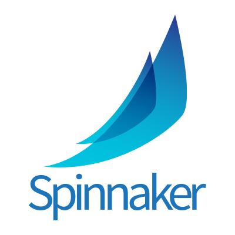

This hands-on is an introduction to Spinnaker as a tool to setup Continuous Deployment on Kubernetes.

## Plan
- Part 1 : Get started 🌶
    - [1 mins] [Introduction](./part1/README.md)
    - [1 mins] [First deployment](./part1/exercise1/README.md)
- Part 2 : Pipelines 🌶
    - [5 mins] [Deployment pipeline](./part2/exercise1/README.md)
    - [5 mins] [Pipeline parametrization](./part2/exercise2/README.md)
    - [5 mins] [Application configuration](./part2/exercise3/README.md)
    - [5 mins] [Liveness and Readyness probes](./part2/exercise4/README.md) TODO
- Part 3 : Zero downtime deployment 🌶🌶
    - [X mins] [Native Blue/Green strategy](part3/README.md) TODO
    - [X mins] [Using Kubernetes labels](./part3/exercise2/README.md) TODO
    - [X mins] [Working with stateFull systems](./part3/exercise3/README.md) TODO
- Part 4 : ??? 🌶🌶(🌶)
