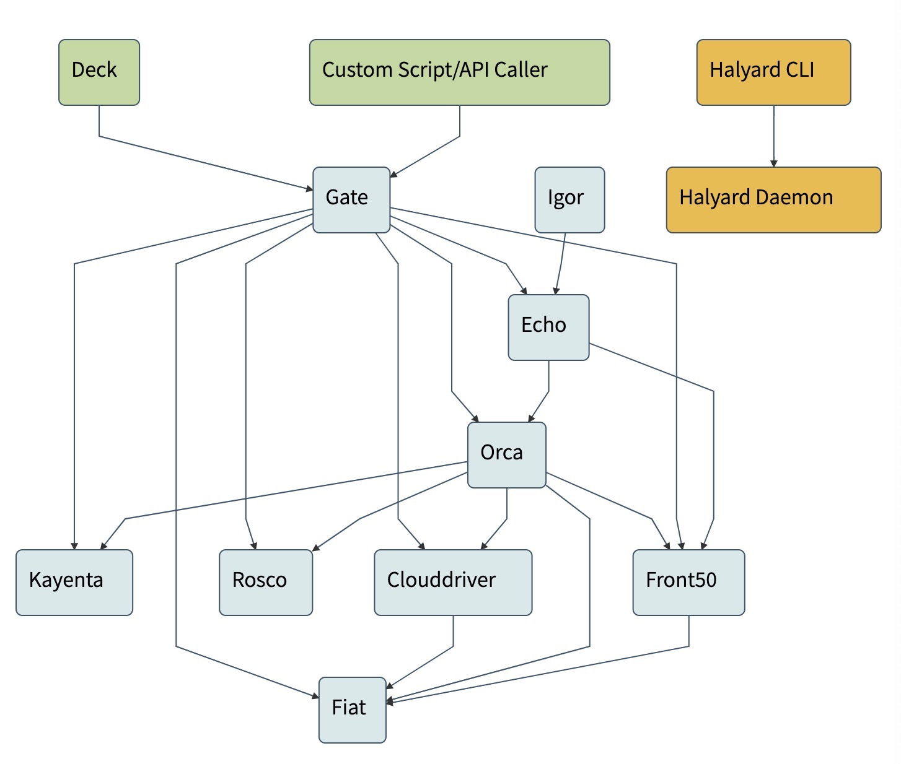

# Get Started
In this hands-on we will focus on using **Spinnaker** in order to orchestrate deployment of resources on Kubernetes.

> Spinnaker is a cloud native Continuous Deployment tool developed by Netflix in collaboration with Google, Pivotal, and Microsoft.

## Introduction  
Spinnaker is actually a set of micro-services working together in order to achieve robust deployment on Cloud Providers:  
- [Deck](https://github.com/spinnaker/deck) is the browser-based UI.
- [Gate](https://github.com/spinnaker/gate) is the API gateway: the Spinnaker UI and all api callers communicate with Spinnaker via Gate.
- [Orca](https://github.com/spinnaker/orca) is the orchestration engine: it handles all ad-hoc operations and pipelines.
- [Clouddriver](https://github.com/spinnaker/clouddriver) is responsible for all mutating calls to the cloud providers and for indexing/caching all deployed resources.
- [Front50](https://github.com/spinnaker/front50) is used to persist the metadata of applications, pipelines, projects and notifications.
- [Rosco](https://github.com/spinnaker/rosco) is the bakery: it produces immutable VM images (or image templates) for various cloud providers (ie: GCE images, AWS AMIs, Azure VM images).
- [Igor](https://github.com/spinnaker/igor) is used to trigger pipelines via continuous integration jobs in systems like Jenkins and Travis CI, and it allows Jenkins/Travis stages to be used in pipelines.
- [Echo](https://github.com/spinnaker/echo) is Spinnaker’s eventing bus: it supports sending notifications (e.g. Slack, email, SMS), and acts on incoming webhooks from services like Github.
- [Fiat](https://github.com/spinnaker/fiat) is Spinnaker’s authorization service: it is used to query a user’s access permissions for accounts, applications and service accounts.
- [Kayenta](https://github.com/spinnaker/kayenta) provides automated canary analysis for Spinnaker.
- [Halyard](https://github.com/spinnaker/halyard) is Spinnaker’s configuration service: Halyard manages the lifecycle of each of the above services. It only interacts with these services during Spinnaker startup, updates, and rollbacks.

The following diagram shows how each of theses micro-services interact with each others.
  
More information can be found on the [official Spinnaker documentation](https://www.spinnaker.io/reference/architecture/).

Installing Spinnaker being outside of the scope of this hands-on, all theses services have already been deployed on Kubernetes.

[next](exercise1/README.md)
