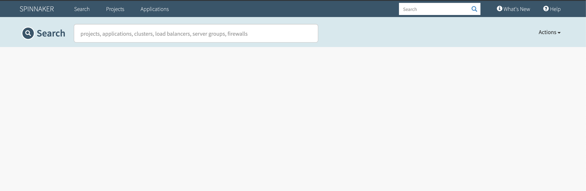
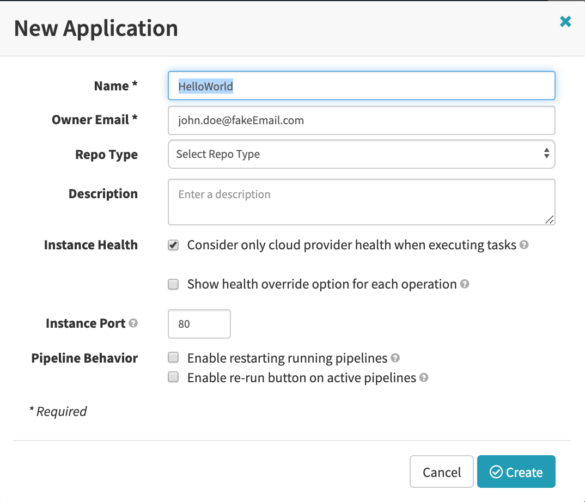
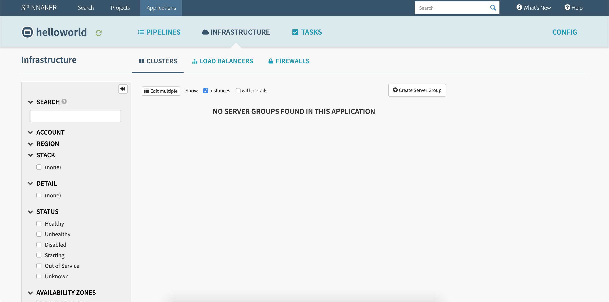
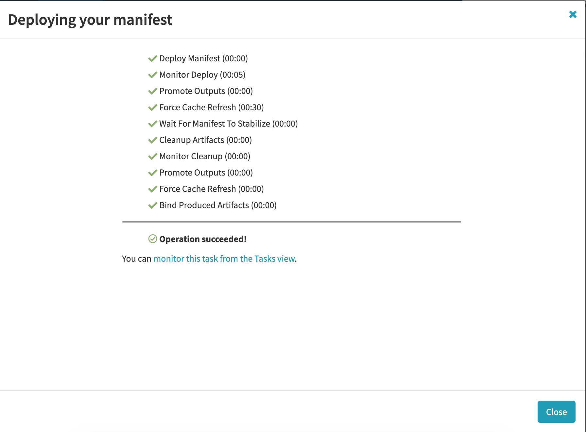
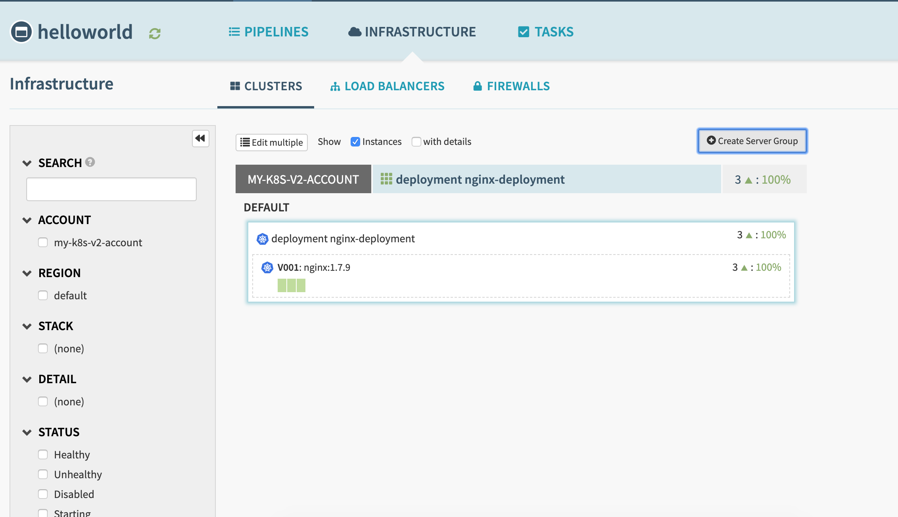

# First deployment
In this section, you will deploy a basic application to Kubernetes with Spinnaker.

## Create the Application
First, you'll need to access the Spinnaker UI.  
Once logged in, you should see something resembling this.  


In order to create your first application: 
- click the "**Action**" button in the upper right corner
- select "**Create Application**"
- fill in the form (see image below)
- save by clicking the green "**Create**" button



Once the application is created, you should be redirected to the **Infrastructure** page.


## Deploy the application
- click the "**Create Server Group**" button
- paste the following YML in the "**Manifest**" section
- click the "**Create**" button.  

```yaml
apiVersion: apps/v1
kind: Deployment
metadata:
  name: nginx-deployment
  labels:
    app: nginx
spec:
  # Number of instantiated Pods running under this ServerGroup
  replicas: 3
  selector:
    matchLabels:
      # This configuration will apply to any Pod labeled nginx
      app: nginx
  template:
    metadata:
      labels:
         # Any created Pod will be labeled nginx
        app: nginx
    spec:
      # Content of each Pods running under this ServerGroup
      containers:
      - name: nginx
        image: nginx:1.7.9
        ports:
        - containerPort: 80
```

A new pop up appears : your application is being deployed.


Close the pop-up, and wait for your pods to become available.


### Summary
We manually created a Server Group:
- Spinnaker created a Cluster to hold the Server Group
- Create a Server Group means to deploy our manifest on Kubernetes
- we can pilot our Kubernetes deployment through the Server Group: click on the Server Group, and play with the options displayed in the right menu.

If you are already familiar with Kubernetes, you might have notice we did nothing we couldn't do with kubectl.
```bash
# The following kubectl command would give you the same result
$ kubectl apply -f myDeployment.yaml
```

Let's continue to the next part.

[previous](../introduction/README.md) | [next](../../part2/exercise1/README.md)

