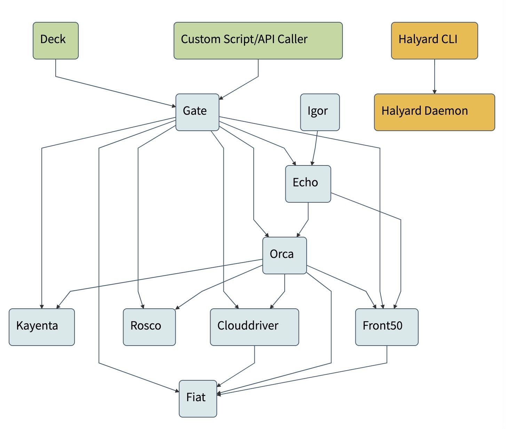

# Introduction
Spinnaker is an open-source Continuous Deployment tool developed by Netflix in collaboration with Google, Pivotal, and Microsoft.  

Spinnaker ship with drivers for multiple cloud providers, interfaces for interop with numerous continuous integration tools, implements built-in deployment strategies based on continuous delivery best practices, and provides tools to orchestrate deployment workflow.  

## Concepts
Spinnaker defines the following [concepts](https://www.spinnaker.io/concepts/) which provide a unified way to orchestrate deployment regardless of the targeted cloud provider.

### Pipeline
[Pipeline](https://www.spinnaker.io/concepts/#pipeline) is the key abstraction concept to orchestrate deployment with Spinnaker.
Pipelines are composed of [Stages](https://www.spinnaker.io/concepts/#stage) which represent a logical grouping of actions to be perform, and each cloud provider supported by Spinnaker comes with dedicated Stages.  
  

### Server Group
Server Groups represent a deployment of a specific artifact (Container, VM, etc...). 
For instance, if we deploy an NGINX application with a Kubernetes ReplicaSet, Spinnaker will create a Server Group which will represent the ReplicaSet.

### Cluster
[Clusters](https://www.spinnaker.io/concepts/clusters/) are logical grouping of Server Groups.
For instance, if we deploy successively three versions of an application, Spinnaker will create one Cluster with three Server Group.  

### Load Balancer
Load balancer represent an Ingress resource balancing traffic between instances inside a Server Groups.  
Spinnaker will create Load Balancer for Kubernetes Services and Ingress rules. 

### Firewall
A Firewall defines network traffic access. It is effectively a set of firewall rules defined by an IP range (CIDR) along with a communication protocol (e.g., TCP) and port range.

### Application
[Applications](https://www.spinnaker.io/guides/user/applications/) regroup all the configuration for a deployment unit.  
For instance, in a micro-service architecture an application might represent a service, and will group its Cluster, Server Groups, Load Balancers, Firewalls, and Pipelines.

### Summary
The following diagram shows how these concepts works together.

## Architecture
Spinnaker is actually a set of micro-services working together in order to achieve robust deployment on Cloud Providers:  
- [Deck](https://github.com/spinnaker/deck) is the browser-based UI.
- [Gate](https://github.com/spinnaker/gate) is the API gateway: the Spinnaker UI and all api callers communicate with Spinnaker via Gate.
- [Orca](https://github.com/spinnaker/orca) is the orchestration engine: it handles all ad-hoc operations and pipelines.
- [Clouddriver](https://github.com/spinnaker/clouddriver) is responsible for all mutating calls to the cloud providers and for indexing/caching all deployed resources.
- [Front50](https://github.com/spinnaker/front50) is used to persist the metadata of applications, pipelines, projects and notifications.
- [Rosco](https://github.com/spinnaker/rosco) is the bakery: it produces immutable VM images (or image templates) for various cloud providers (ie: GCE images, AWS AMIs, Azure VM images).
- [Igor](https://github.com/spinnaker/igor) is used to trigger pipelines via continuous integration jobs in systems like Jenkins and Travis CI, and it allows Jenkins/Travis stages to be used in pipelines.
- [Echo](https://github.com/spinnaker/echo) is Spinnaker’s eventing bus: it supports sending notifications (e.g. Slack, email, SMS), and acts on incoming webhooks from services like Github.
- [Fiat](https://github.com/spinnaker/fiat) is Spinnaker’s authorization service: it is used to query a user’s access permissions for accounts, applications and service accounts.
- [Kayenta](https://github.com/spinnaker/kayenta) provides automated canary analysis for Spinnaker.
- [Halyard](https://github.com/spinnaker/halyard) is Spinnaker’s configuration service: Halyard manages the lifecycle of each of the above services. It only interacts with these services during Spinnaker startup, updates, and rollbacks.

The following diagram shows how each of theses micro-services interact with each others.
  
More information can be found on the [official Spinnaker documentation](https://www.spinnaker.io/reference/architecture/).

Installing Spinnaker being outside the scope of this hands-on, all these services have already been deployed on Kubernetes.

[next](../exercise1/README.md)
