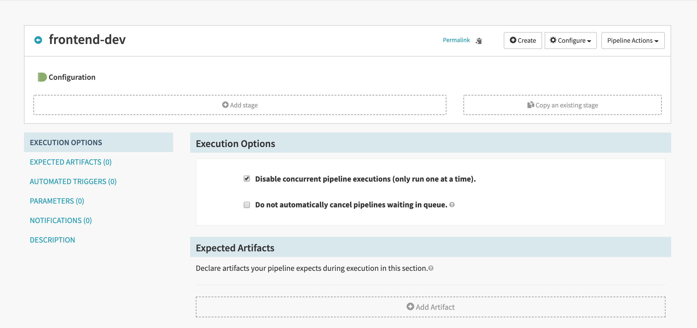
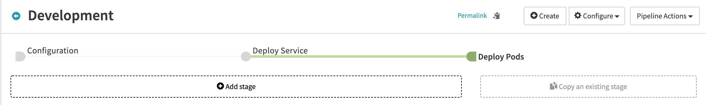
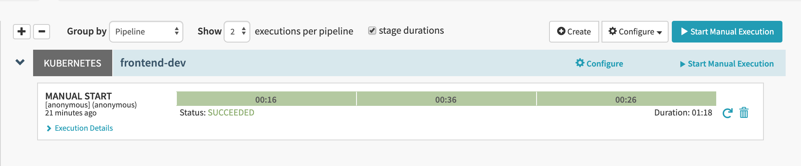

# Deployment pipeline
In this exercise, we'll deploy a front-end application and set-up a pipeline for our development environment.

## Pipeline configuration
First create a new application named "**xebifront**".
> refer to [exercise 1](../../part1/exercise1/README.md) if you need a reminder about how to create an application

Then head to the "**Pipeline**" tab: 
- click "**configure a new pipeline**"
- enter the pipeline name "**Development**"
- click the "**Create**" button

You created an empty pipeline named Development.


This page is the configuration step of the pipeline: every pipeline start with this step.  
We'll get back here later, for now add a new stage:
- select the "**Deploy (Manifest)**" type
- name the stage "Deploy Service"
- select the Kubernetes account spinnaker will use in order to deploy the manifest (only one choice should be available)
- paste the following yml file in the "**Manifest**" section
- save your changes (bottom right corner)

```yaml
apiVersion: v1
kind: Service
metadata:
  name: xebifront-service
spec:
  # The service is exposed to the outside
  type: LoadBalancer
  # selectors are used to find and update pods
  selector:
    app: xebifront
    environment: dev
  ports:
    - protocol: TCP
      # port exposed by the service
      port: 9080
      # port listened by pods
      targetPort: 80
```

This manifest configure a [Kubernetes Service](https://kubernetes.io/docs/concepts/services-networking/service/) which allow other applications to access our pods.  
The following diagram, from the Kubernetes documentation on the [CoreOS website](https://coreos.com/kubernetes/docs/latest/services.html), 
shows how the service **select** the pods which will receive traffics according the their **labels**.


Now, we need to add a new step in order to deploy our pods:
- select the "**Deploy (Manifest)**" type
- name the stage "Deploy Pods"
- select the Kubernetes account spinnaker will use in order to deploy the manifest (only one choice should be available)
- paste the following yml file in the "**Manifest**" section
- save your changes (bottom right corner)  

```yaml
apiVersion: apps/v1
kind: Deployment
metadata:
  name: xebifront-deployment
  labels:
    app: xebifront
spec:
  replicas: 1
  selector:
    # labels used to find pods managed by this deployment
    matchLabels:
      app: xebifront
      environment: dev
  # pods template
  template:
    metadata:
      # labels set to pods created by this deployment
      labels:
        app: xebifront
        environment: dev
    spec:
      containers:
      - name: xebifront
        image: jcalderan/xebifront:v1
        ports:
        - containerPort: 80
```

We defined a [Kubernetes Deployment](https://kubernetes.io/docs/concepts/workloads/controllers/deployment/) in order to manage our pods. All operations on pods (scaling up/down, updating, etc...) will be handled by this manifest.  

You should now have a pipeline resembling this.



Save your changes and go back to the Pipeline tab: you should see your pipeline named "Development".  
Click the button "**Start manual execution**". After a few seconds, your pipeline execution complete !


Take a moment to click on each steps and play with the pipeline results output.  

Go to the "**Infrastructure**" tab : a new Cluster Group has been created, as well as a new Load Balancer.  
Our pipeline ensure new pods won't be deployed if an error occurs when deploying the corresponding Service.

> Using Spinnaker Pipeline, we are able to coordinate deployment of Kubernetes resources depending on each others.

[previous](../../part1/exercise1/README.md) | [next](../exercise2/README.md)
