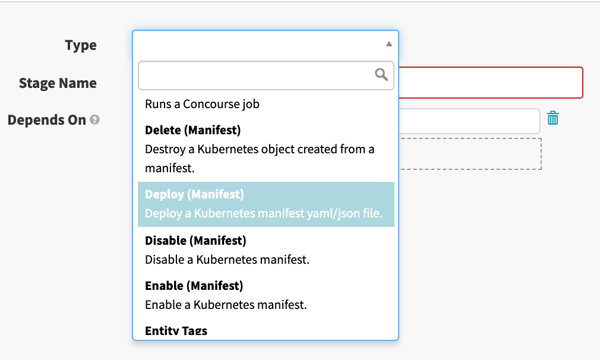
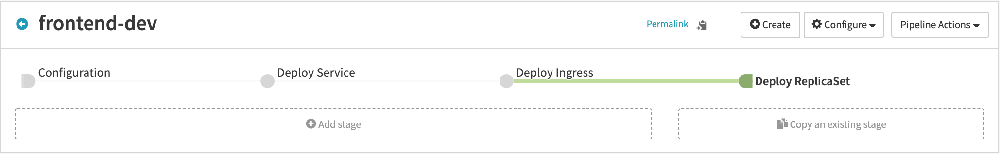
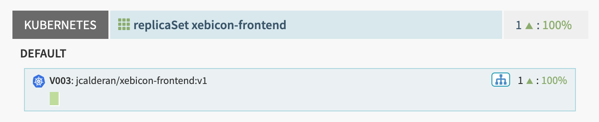
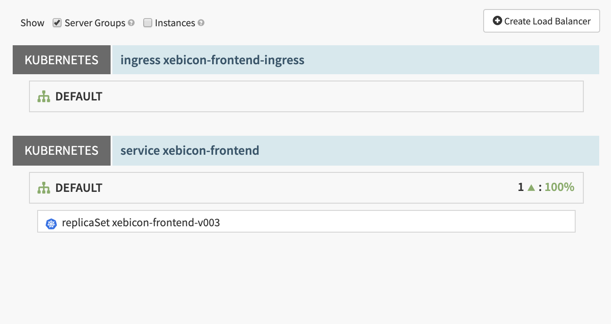
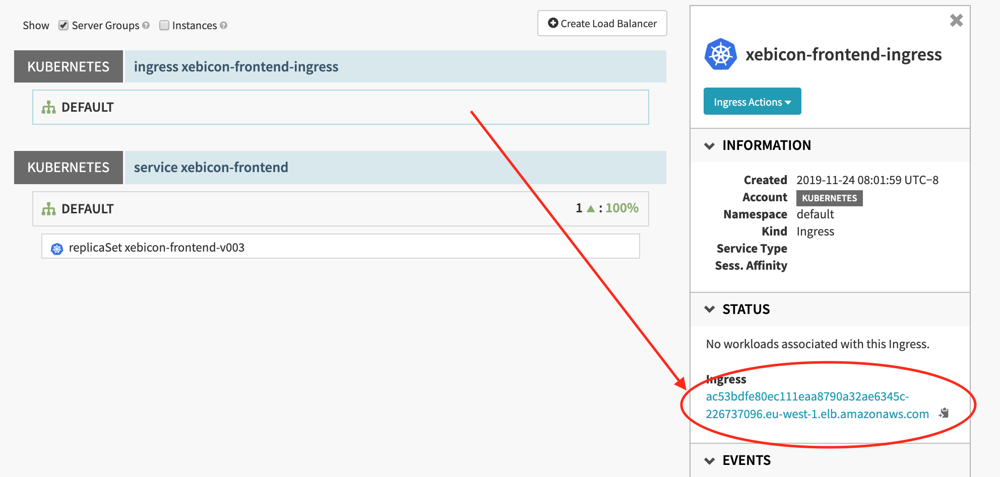

# Xebicon-app
Through the next few exercises, we'll setup the deployment on development environment of an application which display the Xebicon Agenda.  

## Create the Application
First create a new application named "**xebicon-app**".
> refer to [exercise 1](../../part1/exercise1/README.md) if you need a reminder about how to create an application

## Create the Pipeline
Then head to the "**Pipeline**" tab: 
- click "**configure a new pipeline**"
- enter the pipeline name "**frontend-dev**"
- click the "**Create**" button

You created an empty pipeline named "**frontend-dev**".


This page is the configuration stage of the pipeline: every pipeline start with this stage.  
We will get back to the configuration stage later, for now let's add a new stage.

### Service stage
Add a new stage:
- click the "**Add stage**" grey button
- select the "**Deploy (Manifest)**" type  

- select the Kubernetes account Spinnaker will use in order to deploy the manifest (only one choice should be available)
- paste the following YAML file in the "**Manifest**" section
- name the stage "**Deploy Service**"
- save your changes (bottom right corner)

```yaml
apiVersion: v1
kind: Service
metadata:
  # Name of the service
  name: xebicon-frontend
spec:
  # Route traffic to any Pods matching these labels
  selector:
    app: xebicon-frontend
    environment: dev
  ports:
    # publish TCP port 80, and expect pods to be listening on the same port
    - protocol: TCP
      port: 80
```

This manifest configure a [Kubernetes Service](https://kubernetes.io/docs/concepts/services-networking/service/) which allows other applications to access the xebicon-frontend application's pods.  
The following diagram, from the Kubernetes documentation on the [CoreOS website](https://coreos.com/kubernetes/docs/latest/services.html), 
shows how the service **select** the pods which will receive traffics according the their **labels**.


### Ingress stage
Now, we need to add a new step in order to deploy the application's Ingress rule:
- click the "**Add stage**" grey button
- select the "**Deploy (Manifest)**" type
- select the Kubernetes account spinnaker will use in order to deploy the manifest (only one choice should be available)
- paste the following YAML file in the "**Manifest**" section
- name the stage "**Deploy Ingress**"
- save your changes (bottom right corner)  

```yaml
apiVersion: networking.k8s.io/v1beta1
kind: Ingress
metadata:
  # Name of the Ingress rule
  name: xebicon-frontend-ingress
  annotations:
    # Rewrite URL 'mydomain/matchingPath/anything' to 'backendService/anything'
    nginx.ingress.kubernetes.io/rewrite-target: /$2
spec:
  rules:
    - http:
        paths:
          # will match path '/xebicon-frontend/anything' capturing separately (/) and (anything)
          - path: /xebicon-frontend(/|$)(.*)
            backend:
              # Use service named 'xebicon-frontend' as backend on port 80
              serviceName: xebicon-frontend
              servicePort: 80
```
This manifest describe an [Ingress rule](https://kubernetes.io/docs/concepts/services-networking/ingress/) used by the cluster's [Ingress Controller](https://kubernetes.io/docs/concepts/services-networking/ingress-controllers/) in order to route incoming traffic to the right Service, which in turn will route traffic to the right pods.


### ReplicaSet stage
Finally, we need to add a last step in order to deploy the application's pods:
- click the "**Add stage**" grey button
- select the "**Deploy (Manifest)**" type
- select the Kubernetes account spinnaker will use in order to deploy the manifest (only one choice should be available)
- paste the following YAML file in the "**Manifest**" section
- name the stage "**Deploy ReplicaSet**"
- save your changes (bottom right corner)  

```yaml
apiVersion: apps/v1
kind: ReplicaSet
metadata:
  # Name of this replicaSet
  name: xebicon-frontend
  # Labels of this replicaSet (must match the service selector)
  labels:
    app: xebicon-frontend
    environment: dev
spec:
  # Number of pods to keep up and running (exceeding pods will be terminated)
  replicas: 1
  # labels used to find pods managed by this replicaSet
  selector:
    matchLabels:
      app: xebicon-frontend
      environment: dev
  # pods template
  template:
    metadata:
      # labels set to pods created by this replicaSet
      labels:
        app: xebicon-frontend
        environment: dev
    spec:
      containers:
      - name: xebicon-frontend
        image: jcalderan/xebicon-frontend:v1
        # pod will expose port 80
        # the containerised application is expected to be listening on this port
        ports:
        - containerPort: 80
```

We defined a [Kubernetes ReplicaSet](https://kubernetes.io/docs/concepts/workloads/controllers/replicaset) in order to manage our pods, thus all operations on pods (scaling up/down, updating, etc...) will be handled by this manifest.  

### Run the Pipeline
You should now have a pipeline resembling this.


Save your changes and go back to the Pipeline tab: you should see your pipeline named "frontend-dev".  
Click the button "**Start manual execution**".  

After a few seconds, your pipeline execution completes.


Take a moment to click on each steps and play with the pipeline results output.  

Go to the "**Infrastructure**" tab : a new Cluster Group has been created, as well as a new Load Balancer (in Spinnaker terms, not Kubernetes).  


Go to the Load Balancers tab (just below "Infrastructure"). You can see both the Ingress rule and the Service:


You can find the URL of your cluster here:
- click on the Ingress (named "DEFAULT")
- the right menu appears
- copy the address displayed under the label "Ingress": this is the publicly accessible URL of your cluster.



You should be able to access the application at ```http://${clusterURL}/xebicon-frontend```.

### Summary
Our Pipeline ensure new pods won't be deployed if an error occurs during the Ingress/Service stage: using Pipelines, we are able to coordinate deployment stages which depends on each others completion status.  

## Solution
<details>  
  <summary>Piepline solution</summary>  
  <p>  
    Click "Pipeline Actions" (upper right), then click "Edit as JSON", and copy paste the following JSON.  
      
```json
{
  "keepWaitingPipelines": false,
  "limitConcurrent": true,
  "stages": [
    {
      "account": "kubernetes",
      "cloudProvider": "kubernetes",
      "manifests": [
        {
          "apiVersion": "v1",
          "kind": "Service",
          "metadata": {
            "name": "xebicon-frontend"
          },
          "spec": {
            "ports": [
              {
                "port": 80,
                "protocol": "TCP"
              }
            ],
            "selector": {
              "app": "xebicon-frontend",
              "environment": "dev"
            }
          }
        }
      ],
      "moniker": {
        "app": "xebicon-app"
      },
      "name": "Deploy Service",
      "refId": "1",
      "requisiteStageRefIds": [],
      "skipExpressionEvaluation": false,
      "source": "text",
      "trafficManagement": {
        "enabled": false,
        "options": {
          "enableTraffic": false,
          "services": []
        }
      },
      "type": "deployManifest"
    },
    {
      "account": "kubernetes",
      "cloudProvider": "kubernetes",
      "manifests": [
        {
          "apiVersion": "networking.k8s.io/v1beta1",
          "kind": "Ingress",
          "metadata": {
            "annotations": {
              "nginx.ingress.kubernetes.io/rewrite-target": "/$2"
            },
            "name": "xebicon-frontend-ingress"
          },
          "spec": {
            "rules": [
              {
                "http": {
                  "paths": [
                    {
                      "backend": {
                        "serviceName": "xebicon-frontend",
                        "servicePort": 80
                      },
                      "path": "/xebicon-frontend(/|$)(.*)"
                    }
                  ]
                }
              }
            ]
          }
        }
      ],
      "moniker": {
        "app": "xebicon-app"
      },
      "name": "Deploy Ingress",
      "refId": "2",
      "requisiteStageRefIds": [
        "1"
      ],
      "skipExpressionEvaluation": false,
      "source": "text",
      "trafficManagement": {
        "enabled": false,
        "options": {
          "enableTraffic": false,
          "services": []
        }
      },
      "type": "deployManifest"
    },
    {
      "account": "kubernetes",
      "cloudProvider": "kubernetes",
      "manifests": [
        {
          "apiVersion": "apps/v1",
          "kind": "ReplicaSet",
          "metadata": {
            "labels": {
              "app": "xebicon-frontend"
            },
            "name": "xebicon-frontend"
          },
          "spec": {
            "replicas": 1,
            "selector": {
              "matchLabels": {
                "app": "xebicon-frontend",
                "environment": "dev"
              }
            },
            "template": {
              "metadata": {
                "labels": {
                  "app": "xebicon-frontend",
                  "environment": "dev"
                }
              },
              "spec": {
                "containers": [
                  {
                    "image": "jcalderan/xebicon-frontend:v1",
                    "name": "xebicon-frontend",
                    "ports": [
                      {
                        "containerPort": 80
                      }
                    ]
                  }
                ]
              }
            }
          }
        }
      ],
      "moniker": {
        "app": "xebicon-app"
      },
      "name": "Deploy ReplicaSet",
      "refId": "3",
      "requisiteStageRefIds": [
        "2"
      ],
      "skipExpressionEvaluation": false,
      "source": "text",
      "trafficManagement": {
        "enabled": false,
        "options": {
          "enableTraffic": false,
          "services": []
        }
      },
      "type": "deployManifest"
    }
  ],
  "triggers": []
}
```  
  </p>
</details>

[next](../exercise2/README.md)
