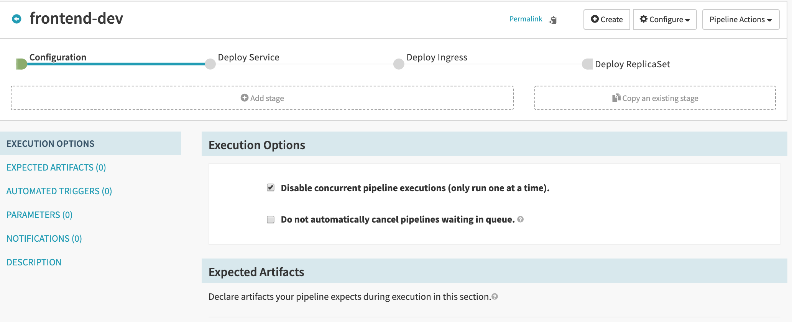
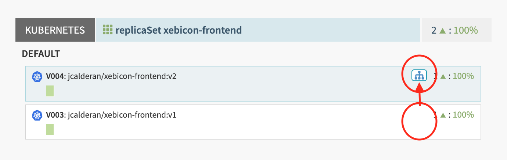

# Configuration Stage
Each pipeline begin with a stage called "Configuration", which contains six sections.  
We will go overs all of them, and see how they allow us to build more flexible pipeline. 

## Execution Options
Options here are self explanatory.  
They allow us to adapt ours Continuous Delivery workload to the need of our development platform and the resources available.

## Expected Artifacts
Because pipelines can be triggered by stages in other pipelines, or be triggered by remote services (Circle CI for instance), 
they may depends on external resources produced by theses upstream stages or services in order to work correctly.  
Theses external resources are called [Artifacts](https://www.spinnaker.io/reference/artifacts/in-pipelines/).

Spinnaker defines a specification in order to describe artifacts, and every artifact must match this specification.  
```
{
  "type":       // How this artifact is classified. Allows for easy distinction
                // between docker images and debian packages, for example.

  "reference":  // The URI.

  "artifactAccount": // The account configured within Spinnaker that has
                // permission to download this resource.

  "name":       // (Optional) A human-readable name that makes matching
                // artifacts simpler.

  "version":    // (Optional) The version of this artifact. By convention, the
                // "version" should be compared against other artifacts with
                // the same "type" and "name".

  "provenance": // (Optional) A link to whatever produced this artifact. This
                // is used for deep-linking into other systems from Spinnaker.

  "metadata":   // (Optional) Arbitrary k/v metadata useful for scripting
                // within stages.

  "location":   // (Optional) The region/zone/namespace this artifact can be
                // found in. This doesn't add information to the URI, but makes
                // multi-regional deployments easier to configure.

  "uuid":       // (Assigned by Spinnaker) Used for tracing artifacts within
                // Spinnaker.
}
```
Thus when an artifact is injected into a pipeline execution context, the pipeline actually receive a JSON payload compliant with the artifact specification.  

When we define an "**Expected Artifact**", we actually define a template against which each artifact received by the pipeline will be matched, until one and only one artifact match.  
If no artifacts match, we can choose to use backup strategies, otherwise the pipeline will fail.

An artifact matched successfully against an expected artifact is said to be "**bound**" to this expected artifact.  
This allows to reference expected artifacts in downstream stages, with the actual artifact being bound at runtime.

> In an actual CI/CD setup using Spinnaker, you shouldn't be editing inplace manifest as we do in this hands-on, but rather pass manifest artifact to your pipeline from upstream pipeline or CI tool. We edit these manifests inplace here for demonstration purpose only. 

## Automated Triggers
This section allows you to configure [automatic triggers](https://www.spinnaker.io/guides/user/pipeline/triggers/).  

Their is many different triggers with different configuration options each.  
Keep in mind that all triggers can supply artifacts for your pipelines, or supply parameters.

Here is an example payload for a [webHook automated trigger](https://www.spinnaker.io/guides/user/pipeline/triggers/webhooks/):
```json
{
  "parameters": {
    "environment": "dev"
  },
  "artifacts": [
      {
        "type": "docker/image",
        "name": "myImage",
        "reference": "repo/myImage"
      }
    ]
}
```

A pipeline can always be trigger manually, even if it specify an automated trigger.

## Parameters
This section allows us to define parameters for our pipeline.  
Theses parameters can be accessed by downstream stages, and they take the form of key/value pairs with additional meta-data attached, 
as a default value and/or a set of options from which users can pick the value from.  

Parameters, as well as other variables injected in the pipeline execution context, can be referenced using the Spinnaker's [Pipeline Expression Language](https://www.spinnaker.io/reference/pipeline/expressions/).  
In fact, the Pipeline Expression Language is implemented using [SpEL](https://docs.spring.io/spring/docs/current/spring-framework-reference/core.html#expressions).

> In order to access parameters, you can use SpEL: ${parameters.myParam}

## Notification
This section allows to setup notification channels hooked on the pipeline's lifecycle steps (started, completed, failed). 

# Exercise
Go to the configuration page of the pipeline created in the [previous exercise](./../exercise1/README.md).   


We hardcoded the version of "xebicon-frontend" to the value "v1" (see the Service and ReplicaSet manifest).  
Modify the pipeline in order be able to specify the version at runtime:
- add a parameter "version": it is **required**, it has a **default value** 'v2', and the possible options are 'v1' and v2' 
- update the Service manifest
    - add a selector: ```version: ${parameters.version}```
- update the ReplicaSet manifest
    - add a label ```version: ${parameters.version}```
    - add a matchLabels: ```version: ${parameters.version}```
    - add a template label: ```version: ${parameters.version}```
    - change the container image to ```'jcalderan/xebicon-frontend:${parameters.version}'``` 
- start the pipeline using parameter 'v2'

Head to the Infrastructure view: a new replicaSet has been deployed, and the 'Load Balancer' (our Service) switched from the previous Service Group to the new one.  
  

You can also refresh ```http://${clusterURL}/xebicon-frontend``` in order to see the new version deployed (it display an error message because this version of the application need a backend application to get its data).

## Summary
- parameters and other variables can be injected into Manifests using SpEL syntax
- Kubernetes Services route traffic to pods whose labels match the Service selectors

## Solution
<details>  
  <summary>Pipeline solution</summary>  
  <p>  
    Click "Pipeline Actions" (upper right), then click "Edit as JSON", and copy paste the following JSON.  

```json
{
  "keepWaitingPipelines": false,
  "limitConcurrent": true,
  "parameterConfig": [
    {
      "default": "v2",
      "description": "application version",
      "hasOptions": true,
      "label": "version",
      "name": "version",
      "options": [
        {
          "value": "v1"
        },
        {
          "value": "v2"
        }
      ],
      "pinned": false,
      "required": true
    }
  ],
  "stages": [
    {
      "account": "kubernetes",
      "cloudProvider": "kubernetes",
      "manifests": [
        {
          "apiVersion": "v1",
          "kind": "Service",
          "metadata": {
            "name": "xebicon-frontend",
            "version": "${parameters.version}"
          },
          "spec": {
            "ports": [
              {
                "port": 80,
                "protocol": "TCP"
              }
            ],
            "selector": {
              "app": "xebicon-frontend",
              "environment": "dev"
            }
          }
        }
      ],
      "moniker": {
        "app": "xebicon-app"
      },
      "name": "Deploy Service",
      "refId": "1",
      "requisiteStageRefIds": [],
      "skipExpressionEvaluation": false,
      "source": "text",
      "trafficManagement": {
        "enabled": false,
        "options": {
          "enableTraffic": false,
          "services": []
        }
      },
      "type": "deployManifest"
    },
    {
      "account": "kubernetes",
      "cloudProvider": "kubernetes",
      "manifests": [
        {
          "apiVersion": "networking.k8s.io/v1beta1",
          "kind": "Ingress",
          "metadata": {
            "annotations": {
              "nginx.ingress.kubernetes.io/rewrite-target": "/$2"
            },
            "name": "xebicon-frontend-ingress"
          },
          "spec": {
            "rules": [
              {
                "http": {
                  "paths": [
                    {
                      "backend": {
                        "serviceName": "xebicon-frontend",
                        "servicePort": 80
                      },
                      "path": "/xebicon-frontend(/|$)(.*)"
                    }
                  ]
                }
              }
            ]
          }
        }
      ],
      "moniker": {
        "app": "xebicon-app"
      },
      "name": "Deploy Ingress",
      "refId": "2",
      "requisiteStageRefIds": [
        "1"
      ],
      "skipExpressionEvaluation": false,
      "source": "text",
      "trafficManagement": {
        "enabled": false,
        "options": {
          "enableTraffic": false,
          "services": []
        }
      },
      "type": "deployManifest"
    },
    {
      "account": "kubernetes",
      "cloudProvider": "kubernetes",
      "manifests": [
        {
          "apiVersion": "apps/v1",
          "kind": "ReplicaSet",
          "metadata": {
            "labels": {
              "app": "xebicon-frontend",
              "environment": "dev",
              "version": "${parameters.version}"
            },
            "name": "xebicon-frontend"
          },
          "spec": {
            "replicas": 1,
            "selector": {
              "matchLabels": {
                "app": "xebicon-frontend",
                "environment": "dev",
                "version": "${parameters.version}"
              }
            },
            "template": {
              "metadata": {
                "labels": {
                  "app": "xebicon-frontend",
                  "environment": "dev",
                  "version": "${parameters.version}"
                }
              },
              "spec": {
                "containers": [
                  {
                    "image": "jcalderan/xebicon-frontend:${parameters.version}",
                    "name": "xebicon-frontend",
                    "ports": [
                      {
                        "containerPort": 80
                      }
                    ]
                  }
                ]
              }
            }
          }
        }
      ],
      "moniker": {
        "app": "xebicon-app"
      },
      "name": "Deploy ReplicaSet",
      "refId": "3",
      "requisiteStageRefIds": [
        "2"
      ],
      "skipExpressionEvaluation": false,
      "source": "text",
      "trafficManagement": {
        "enabled": false,
        "options": {
          "enableTraffic": false,
          "services": []
        }
      },
      "type": "deployManifest"
    }
  ],
  "triggers": []
}
```
  </p>
</details

[previous](../exercise1/README.md) | [next](../exercise3/README.md)
