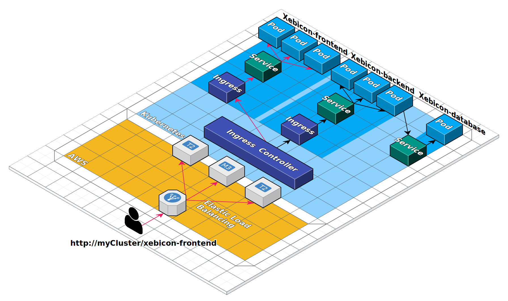

# Xebicon-app - version 2
In the [previous exercise](../exercise2/README.md) we learnt to parametrize our pipeline, 
and we added a new parameter "version".

This version v2 of *xebicon-frontend* uses a backend application in order to fetch the Xebicon slots to display.  
In order to get it working, we'll need to deploy two new applications:
- xebicon-backend: the API consumed by xebicon-frontend
- xebicon-database: the database storing the Xebicon slots 

Both the frontend and the backend applications have to be exposed to the Internet through a publicly reachable URL, 
while the database must only be accessible from the inside of the Cluster.  
The following diagram illustrate this setup.


When a user request ```http://${clusterURL}/xebicon-frontend```, the name is resolved to an [AWS Elastic Load Balancer](https://aws.amazon.com/elasticloadbalancing/) which
route the request to any node of the Kubernetes cluster.  
An [Ingress Controller](https://kubernetes.io/docs/concepts/services-networking/ingress-controllers/) runs on every node, and will read [Ingress](https://kubernetes.io/fr/docs/concepts/services-networking/ingress/) rules in order to know to which Service the request should be routed.  
In turn, Services will route traffic to Pods matching their selectors.  
There is no Ingress rule for the database because 
we wont access it from outside of the cluster, however a Service must exists in order for other application within the cluster to access the database.

## Setting up the backend application
This application is a simple Node.js application which **listen on port 80**, and exposes **two endpoints**:
- /: fetch all slots stored in database
- /health: return ```200 OK {"status": "up"}``` when the application is up and running

Create a new pipeline "**backend-dev**":
- the application is only available in verson 'v1'
- deploy a new Service named "xebicon-backend", listening on port 80
- deploy a new Ingress named "xebicon-backend", exposing a backend path "/xebicon-backend"
- deploy a Kubernetes ReplicaSet (use the docker image ```jcalderan/xebicon-backend```)

### Summary
- we created a new pipeline for the backend application xebicon-application
- the application is accessible from the internet at ```http://${clusterURL}/xebicon-backend``` thanks to its **Ingress Rule**
- the application is still unable to connect to the database
- you can create Pipeline from other existing Pipeline

## Setting up the database
This application is a single node MongoDB database which **listen on port 27017**.
The database being **unreachable from the outside of the cluster**, we won't deploy an Ingress rule for this application.

Create a new pipeline "**database-dev**":
- the application is only available in verson 'v1'
- deploy a new Service named "xebicon-database", listening on port 27017
- deploy a Kubernetes replicaSet (use the docker image ```jcalderan/xebicon-database```)

### Summary
- we created a new pipeline for the database application xebicon-database
- the application is not accessible from the internet
- the database await connection on port 27017

## Run everything
At this point, you should have three pipelines. Run all of them:
- frontend-dev: deploy version 2
- backend-dev: deploy version 1
- database-dev: deploy version 1

All pipeline should be successfull.


Does that mean our application is working as expected ?
Go back to the xebicon-frontend homepage (```http://${clusterURL}/xebicon-frontend```): the application now display a message 'loading...'.  
This is because we deployed the backend Ingress rules, allowing the frontend application to access the backend API, however we didn't configure the link between the backend API and the database.  
This mean our backend API receives traffic while one of its critical dependency is unreachable.

> A successfull deployment doesn't mean a working application. Be sure to implement health checks to detect healthy components and identify components which are ready to receive traffic.

Kubernetes allows us to define [probes](https://kubernetes.io/docs/concepts/workloads/pods/pod-lifecycle/#container-probes) in order to monitor our application lifecycle (running, ready, dead).  

## Accessing the database
Services and Pods names can be resolved [using DNS names](https://kubernetes.io/docs/concepts/services-networking/dns-pod-service/)
inside a Kubernetes cluster, using a name of the form:
- my-service.my-namespace.svc.cluster-domain.example
- my-pod.my-namespace.svc.cluster-domain.example
- my-service if the calling resource is in the same namespace

This means any **xebicon-backend** pod can connect to the **xebicon-database** Service using the DNS name ```xebicon-database.default.svc.cluster.local``` (```xebicon-database``` if they both live in the same namespace).

### Exercises
Update the backend-dev pipeline:
- the backend application use an [environment variable](https://kubernetes.io/docs/tasks/inject-data-application/define-environment-variable-container/) named **DB_URL** in order to connect to the database. 
The value of this variable should be in the form of 'mongodb://database-service-name:27017'.  

When all pipeline has run, the infrastructure view should look like this.


### Solution

<details>
    <summary>backend-dev solution</summary>
    <p>
    Click "Pipeline Actions" (upper right), then click "Edit as JSON", and copy paste the following JSON.

```json
{
  "keepWaitingPipelines": false,
  "limitConcurrent": true,
  "parameterConfig": [
    {
      "default": "v1",
      "description": "",
      "hasOptions": true,
      "label": "version",
      "name": "version",
      "options": [
        {
          "value": "v1"
        }
      ],
      "pinned": false,
      "required": true
    }
  ],
  "stages": [
    {
      "account": "kubernetes",
      "cloudProvider": "kubernetes",
      "manifests": [
        {
          "apiVersion": "v1",
          "kind": "Service",
          "metadata": {
            "name": "xebicon-backend"
          },
          "spec": {
            "ports": [
              {
                "port": 80,
                "protocol": "TCP"
              }
            ],
            "selector": {
              "app": "xebicon-backend",
              "environment": "dev",
              "version": "${parameters.version}"
            }
          }
        }
      ],
      "moniker": {
        "app": "xebicon-app"
      },
      "name": "Deploy Service",
      "refId": "1",
      "requisiteStageRefIds": [],
      "skipExpressionEvaluation": false,
      "source": "text",
      "trafficManagement": {
        "enabled": false,
        "options": {
          "enableTraffic": false,
          "services": []
        }
      },
      "type": "deployManifest"
    },
    {
      "account": "kubernetes",
      "cloudProvider": "kubernetes",
      "manifests": [
        {
          "apiVersion": "networking.k8s.io/v1beta1",
          "kind": "Ingress",
          "metadata": {
            "annotations": {
              "nginx.ingress.kubernetes.io/rewrite-target": "/$2"
            },
            "name": "xebicon-backend-ingress"
          },
          "spec": {
            "rules": [
              {
                "http": {
                  "paths": [
                    {
                      "backend": {
                        "serviceName": "xebicon-backend",
                        "servicePort": 80
                      },
                      "path": "/xebicon-backend(/|$)(.*)"
                    }
                  ]
                }
              }
            ]
          }
        }
      ],
      "moniker": {
        "app": "xebicon-app"
      },
      "name": "Deploy Ingress",
      "refId": "2",
      "requisiteStageRefIds": [
        "1"
      ],
      "skipExpressionEvaluation": false,
      "source": "text",
      "trafficManagement": {
        "enabled": false,
        "options": {
          "enableTraffic": false,
          "services": []
        }
      },
      "type": "deployManifest"
    },
    {
      "account": "kubernetes",
      "cloudProvider": "kubernetes",
      "manifests": [
        {
          "apiVersion": "apps/v1",
          "kind": "ReplicaSet",
          "metadata": {
            "labels": {
              "app": "xebicon-backend",
              "environment": "dev",
              "version": "${parameters.version}"
            },
            "name": "xebicon-backend"
          },
          "spec": {
            "replicas": 1,
            "selector": {
              "matchLabels": {
                "app": "xebicon-backend",
                "environment": "dev",
                "version": "${parameters.version}"
              }
            },
            "template": {
              "metadata": {
                "labels": {
                  "app": "xebicon-backend",
                  "environment": "dev",
                  "version": "${parameters.version}"
                }
              },
              "spec": {
                "containers": [
                  {
                    "image": "jcalderan/xebicon-backend:${parameters.version}",
                    "name": "xebicon-backend",
                    "ports": [
                      {
                        "containerPort": 80
                      }
                    ]
                  }
                ]
              }
            }
          }
        }
      ],
      "moniker": {
        "app": "xebicon-app"
      },
      "name": "Deploy ReplicaSet",
      "refId": "3",
      "requisiteStageRefIds": [
        "2"
      ],
      "skipExpressionEvaluation": false,
      "source": "text",
      "trafficManagement": {
        "enabled": false,
        "options": {
          "enableTraffic": false,
          "services": []
        }
      },
      "type": "deployManifest"
    }
  ],
  "triggers": []
}
```
 </p>
</details>

<details>
    <summary>database-dev solution</summary>
    <p>
    Click "Pipeline Actions" (upper right), then click "Edit as JSON", and copy paste the following JSON.

```json
```
 </p>
</details>

[previous](../exercise2/README.md) | [next](../exercise4/README.md)
