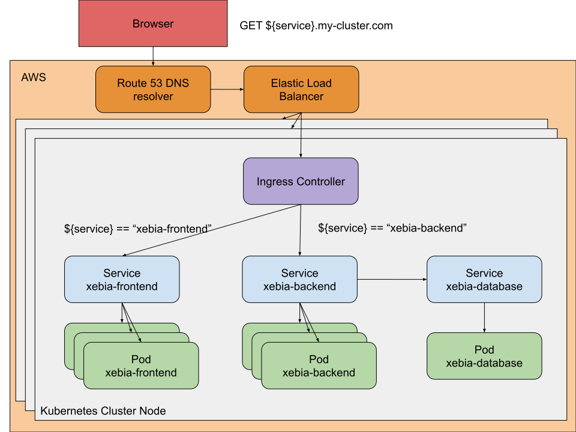
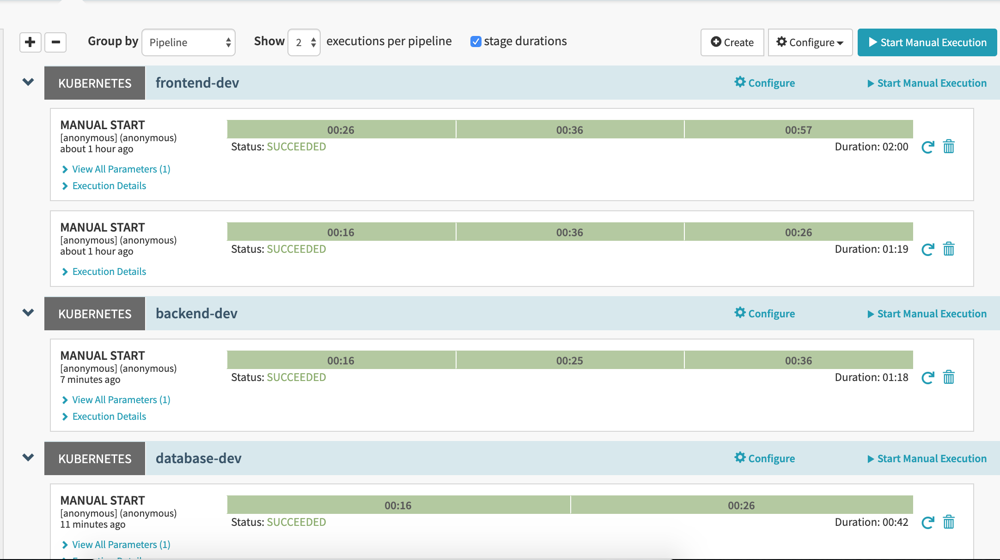
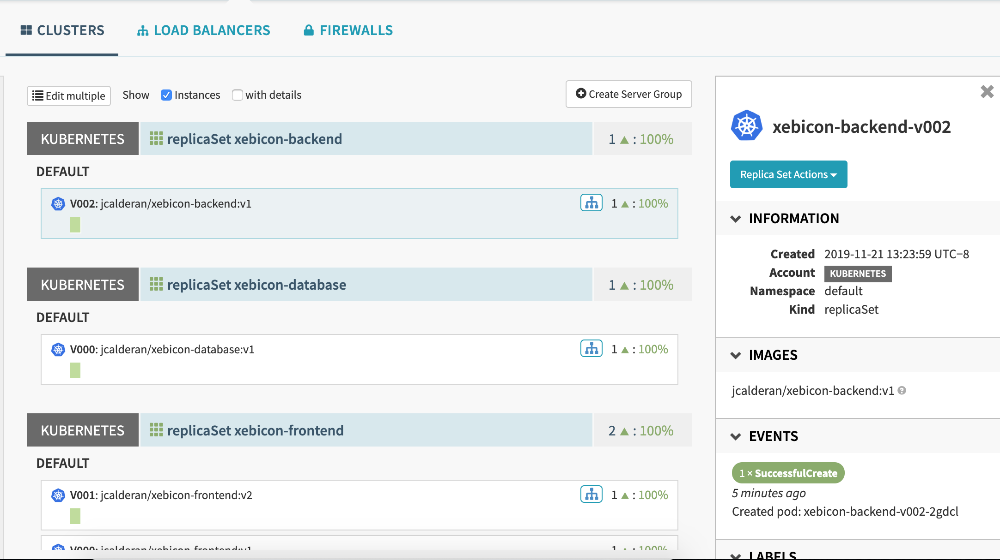

# Application configuration
In the [previous exercise](../exercise2/README.md) we learnt to parametrize our pipeline, 
and we added a new parameter "version".

This version v2 of xebicon-frontend use a Back-End application in order to fetch the Xebicon slots to display.  
In order to get it working, we'll need to deploy two new applications:
- xebicon-backend: the API consumed by xebicon-frontend
- xebicon-database: the database hosting the Xebicon slots data 

Both the Front-End and the Back-End applications have to be exposed to the Internet through a publicly reachable URL, 
while the database must only be accessible from the inside of the Cluster.  
The following diagram illustrate this setup.


## Seting up the backend application
Create a new pipeline "**backend-dev**" in order to:
- deploy a new Service named "xebicon-backend"
- deploy a new Ingress named "xebicon-backend"
- deploy a Kubernetes ReplicaSet (use the docker image ```jcalderan/xebicon-backend:v1```)

This application is a simple Node.js application which **listen on port 8080**, and exposes **two endpoints**:
- /: fetch all slots stored in database
- /health: return ```200 OK {"status": "up"}``` when the application is up and running 

## Setting up the database
Create a new pipeline "**xebicon-database**" in order to:
- deploy a new Service named "xebicon-database"
- deploy a Kubernetes replicaSet (use the docker image ```jcalderan/xebicon-database:v1```)

This application is a single node MongoDB database which **listen on port 27017**.
The database being unreachable from the outside of the cluster, we won't deploy an Ingress rule for this application.

## Run everything
At this point, you should have three pipelines. Run all of them:
- frontend-dev: deploy version 2
- backend-dev: deploy version 1
- database-dev: deploy version 1

All pipeline should be successfull.


Does that mean our application is working as expected ?
Go back to the xebicon-frontend homepage (```http://yourdomain/xebicon-frontend```): the application now display a message 'loading...'.  
This is because we deployed the backend Ingress rules, allowing the frontend application to access the backend API, however we didn't configure the link between the backend API and the database. This mean our backend API receives traffic while one of its critical dependency is unreachable.

> A successfull deployment doesn't mean a working application. Be sure to implement automated ways to detect healthy components and identify components which are ready to receive traffic.

Kubernetes allows us to define [probes](https://kubernetes.io/docs/concepts/workloads/pods/pod-lifecycle/#container-probes) in order to monitor our application lifecycle.  

## Wiring up everything
We need to connect all three components.  

In order to access both applications from the Internet, we will use a domain name which resolve to our kubernetes cluster:
- [Route53](https://aws.amazon.com/en/route53/) is a DNS web service by AWS, which has already been provisioned in order to resolve the domain name ```*.my-cluster.com```
- [Elastic Load Balancer](https://aws.amazon.com/elasticloadbalancing/), is an AWS Load Balancer which has been provisioned in order to forward traffic to the Kubernetes cluster nodes.  
- [Ingress Controller](https://kubernetes.io/docs/concepts/services-networking/ingress-controllers/) is a Kubernetes components which implements Ingress rules in order to root incoming traffic to relevant Services.

Thus, route53 will resolve any sub-domain of ```*.my-cluster.com``` and forward the traffic to the ELB which in turn will forward the traffic to the kubernetes cluster node. When a request hit a cluster node, the Ingress Controller will look for matching Ingress rules, and route traffic to Services according to these rules.
 
Services and Pods names can be resolved [using DNS names](https://kubernetes.io/docs/concepts/services-networking/dns-pod-service/)
inside a Kubernetes cluster, using a name of the form:
- my-service.my-namespace.svc.cluster-domain.example
- my-pod.my-namespace.svc.cluster-domain.example

This means any **xebicon-backend** pod can connect to the **xebicon-database** Service using the DNS name ```xebicon-database.your-namespace.svc.cluster.local``` (or just ```xebicon-database``` if they both live in the same namespace).

### Exercises
Update the backend-dev pipeline:
- the Frontend application expect the backend API to be publicly accessible under the same domaine name, under the path '/xebicon-backend'.  
- the backend application use an [environment variable](https://kubernetes.io/docs/tasks/inject-data-application/define-environment-variable-container/) named **DB_URL** in order to connect to the database. This variable should be in the form of 'mongodb://DB_URL:27017'.  

When all pipeline has run, the infrastructure view should look like this.


<details>
    <summary>frontend-dev solution</summary>
    <p>
    Click "Pipeline Actions" (upper right), then click "Edit as JSON", and copy paste the following JSON.

```json
{
  "keepWaitingPipelines": false,
  "lastModifiedBy": "anonymous",
  "limitConcurrent": true,
  "parameterConfig": [
    {
      "default": "v2",
      "description": "application version",
      "hasOptions": true,
      "label": "version",
      "name": "version",
      "options": [
        {
          "value": "v1"
        },
        {
          "value": "v2"
        }
      ],
      "pinned": false,
      "required": true
    }
  ],
  "stages": [
    {
      "account": "kubernetes",
      "cloudProvider": "kubernetes",
      "manifests": [
        {
          "apiVersion": "networking.k8s.io/v1beta1",
          "kind": "Ingress",
          "metadata": {
            "annotations": {
              "nginx.ingress.kubernetes.io/rewrite-target": "/$2"
            },
            "name": "xebicon-frontend-ingress"
          },
          "spec": {
            "rules": [
              {
                "http": {
                  "paths": [
                    {
                      "backend": {
                        "serviceName": "xebicon-frontend",
                        "servicePort": 80
                      },
                      "path": "/xebicon-frontend(/|$)(.*)"
                    }
                  ]
                }
              }
            ]
          }
        }
      ],
      "moniker": {
        "app": "xebicon-app"
      },
      "name": "Deploy Ingress",
      "refId": "1",
      "requisiteStageRefIds": [
        "2"
      ],
      "skipExpressionEvaluation": false,
      "source": "text",
      "trafficManagement": {
        "enabled": false,
        "options": {
          "enableTraffic": false,
          "services": []
        }
      },
      "type": "deployManifest"
    },
    {
      "account": "kubernetes",
      "cloudProvider": "kubernetes",
      "manifests": [
        {
          "apiVersion": "v1",
          "kind": "Service",
          "metadata": {
            "name": "xebicon-frontend"
          },
          "spec": {
            "ports": [
              {
                "port": 80,
                "protocol": "TCP"
              }
            ],
            "selector": {
              "app": "xebicon-frontend",
              "environment": "dev",
              "version": "${parameters.version}"
            }
          }
        }
      ],
      "moniker": {
        "app": "xebicon-app"
      },
      "name": "Deploy Service",
      "refId": "2",
      "requisiteStageRefIds": [],
      "skipExpressionEvaluation": false,
      "source": "text",
      "trafficManagement": {
        "enabled": false,
        "options": {
          "enableTraffic": false,
          "services": []
        }
      },
      "type": "deployManifest"
    },
    {
      "account": "kubernetes",
      "cloudProvider": "kubernetes",
      "manifests": [
        {
          "apiVersion": "apps/v1",
          "kind": "ReplicaSet",
          "metadata": {
            "labels": {
              "app": "xebicon-frontend"
            },
            "name": "xebicon-frontend"
          },
          "spec": {
            "replicas": 1,
            "selector": {
              "matchLabels": {
                "app": "xebicon-frontend",
                "environment": "dev",
                "version": "${parameters.version}"
              }
            },
            "template": {
              "metadata": {
                "labels": {
                  "app": "xebicon-frontend",
                  "environment": "dev",
                  "version": "${parameters.version}"
                }
              },
              "spec": {
                "containers": [
                  {
                    "image": "jcalderan/xebicon-frontend:${parameters.version}",
                    "name": "xebicon-frontend",
                    "ports": [
                      {
                        "containerPort": 80
                      }
                    ]
                  }
                ]
              }
            }
          }
        }
      ],
      "moniker": {
        "app": "xebicon-app"
      },
      "name": "Deploy Pods",
      "refId": "3",
      "requisiteStageRefIds": [
        "1"
      ],
      "skipExpressionEvaluation": false,
      "source": "text",
      "trafficManagement": {
        "enabled": false,
        "options": {
          "enableTraffic": false,
          "services": []
        }
      },
      "type": "deployManifest"
    }
  ],
  "triggers": []
}
```
 </p>
</details>

<details>
    <summary>backend-dev solution</summary>
    <p>
    Click "Pipeline Actions" (upper right), then click "Edit as JSON", and copy paste the following JSON.

```json
{
  "keepWaitingPipelines": false,
  "lastModifiedBy": "anonymous",
  "limitConcurrent": true,
  "parameterConfig": [
    {
      "default": "v1",
      "description": "application version",
      "hasOptions": true,
      "label": "version",
      "name": "version",
      "options": [
        {
          "value": "v1"
        }
      ],
      "pinned": false,
      "required": true
    }
  ],
  "stages": [
    {
      "account": "kubernetes",
      "cloudProvider": "kubernetes",
      "manifests": [
        {
          "apiVersion": "networking.k8s.io/v1beta1",
          "kind": "Ingress",
          "metadata": {
            "annotations": {
              "nginx.ingress.kubernetes.io/rewrite-target": "/$2"
            },
            "name": "xebicon-backend-ingress"
          },
          "spec": {
            "rules": [
              {
                "http": {
                  "paths": [
                    {
                      "backend": {
                        "serviceName": "xebicon-backend",
                        "servicePort": 80
                      },
                      "path": "/xebicon-backend(/|$)(.*)"
                    }
                  ]
                }
              }
            ]
          }
        }
      ],
      "moniker": {
        "app": "xebicon-app"
      },
      "name": "Deploy Ingress",
      "refId": "1",
      "requisiteStageRefIds": [
        "2"
      ],
      "skipExpressionEvaluation": false,
      "source": "text",
      "trafficManagement": {
        "enabled": false,
        "options": {
          "enableTraffic": false,
          "services": []
        }
      },
      "type": "deployManifest"
    },
    {
      "account": "kubernetes",
      "cloudProvider": "kubernetes",
      "manifests": [
        {
          "apiVersion": "v1",
          "kind": "Service",
          "metadata": {
            "name": "xebicon-backend"
          },
          "spec": {
            "ports": [
              {
                "port": 80,
                "protocol": "TCP"
              }
            ],
            "selector": {
              "app": "xebicon-backend",
              "environment": "dev",
              "version": "${parameters.version}"
            }
          }
        }
      ],
      "moniker": {
        "app": "xebicon-app"
      },
      "name": "Deploy Service",
      "refId": "2",
      "requisiteStageRefIds": [],
      "skipExpressionEvaluation": false,
      "source": "text",
      "trafficManagement": {
        "enabled": false,
        "options": {
          "enableTraffic": false,
          "services": []
        }
      },
      "type": "deployManifest"
    },
    {
      "account": "kubernetes",
      "cloudProvider": "kubernetes",
      "manifests": [
        {
          "apiVersion": "apps/v1",
          "kind": "ReplicaSet",
          "metadata": {
            "labels": {
              "app": "xebicon-backend"
            },
            "name": "xebicon-backend"
          },
          "spec": {
            "replicas": 1,
            "selector": {
              "matchLabels": {
                "app": "xebicon-backend",
                "environment": "dev",
                "version": "${parameters.version}"
              }
            },
            "template": {
              "metadata": {
                "labels": {
                  "app": "xebicon-backend",
                  "environment": "dev",
                  "version": "${parameters.version}"
                }
              },
              "spec": {
                "containers": [
                  {
                    "env": [
                      {
                        "name": "DB_URL",
                        "value": "mongodb://xebicon-database:27017"
                      }
                    ],
                    "image": "jcalderan/xebicon-backend:${parameters.version}",
                    "name": "xebicon-backend",
                    "ports": [
                      {
                        "containerPort": 80
                      }
                    ]
                  }
                ]
              }
            }
          }
        }
      ],
      "moniker": {
        "app": "xebicon-app"
      },
      "name": "Deploy Pods",
      "refId": "3",
      "requisiteStageRefIds": [
        "1"
      ],
      "skipExpressionEvaluation": false,
      "source": "text",
      "trafficManagement": {
        "enabled": false,
        "options": {
          "enableTraffic": false,
          "services": []
        }
      },
      "type": "deployManifest"
    }
  ],
  "triggers": []
}
```
 </p>
</details>

<details>
    <summary>database-dev solution</summary>
    <p>
    Click "Pipeline Actions" (upper right), then click "Edit as JSON", and copy paste the following JSON.

```json
{
  "keepWaitingPipelines": false,
  "lastModifiedBy": "anonymous",
  "limitConcurrent": true,
  "parameterConfig": [
    {
      "default": "v1",
      "description": "application version",
      "hasOptions": true,
      "label": "version",
      "name": "version",
      "options": [
        {
          "value": "v1"
        }
      ],
      "pinned": false,
      "required": true
    }
  ],
  "stages": [
    {
      "account": "kubernetes",
      "cloudProvider": "kubernetes",
      "manifests": [
        {
          "apiVersion": "v1",
          "kind": "Service",
          "metadata": {
            "name": "xebicon-database"
          },
          "spec": {
            "ports": [
              {
                "port": 27017,
                "protocol": "TCP"
              }
            ],
            "selector": {
              "app": "xebicon-database",
              "environment": "dev",
              "version": "${parameters.version}"
            }
          }
        }
      ],
      "moniker": {
        "app": "xebicon-app"
      },
      "name": "Deploy Service",
      "refId": "2",
      "requisiteStageRefIds": [],
      "skipExpressionEvaluation": false,
      "source": "text",
      "trafficManagement": {
        "enabled": false,
        "options": {
          "enableTraffic": false,
          "services": []
        }
      },
      "type": "deployManifest"
    },
    {
      "account": "kubernetes",
      "cloudProvider": "kubernetes",
      "manifests": [
        {
          "apiVersion": "apps/v1",
          "kind": "ReplicaSet",
          "metadata": {
            "labels": {
              "app": "xebicon-database"
            },
            "name": "xebicon-database"
          },
          "spec": {
            "replicas": 1,
            "selector": {
              "matchLabels": {
                "app": "xebicon-database",
                "environment": "dev",
                "version": "${parameters.version}"
              }
            },
            "template": {
              "metadata": {
                "labels": {
                  "app": "xebicon-database",
                  "environment": "dev",
                  "version": "${parameters.version}"
                }
              },
              "spec": {
                "containers": [
                  {
                    "image": "jcalderan/xebicon-database:${parameters.version}",
                    "name": "xebicon-database",
                    "ports": [
                      {
                        "containerPort": 27017
                      }
                    ]
                  }
                ]
              }
            }
          }
        }
      ],
      "moniker": {
        "app": "xebicon-app"
      },
      "name": "Deploy Pods",
      "refId": "3",
      "requisiteStageRefIds": [
        "2"
      ],
      "skipExpressionEvaluation": false,
      "source": "text",
      "trafficManagement": {
        "enabled": false,
        "options": {
          "enableTraffic": false,
          "services": []
        }
      },
      "type": "deployManifest"
    }
  ],
  "triggers": []
}
```
 </p>
</details>
