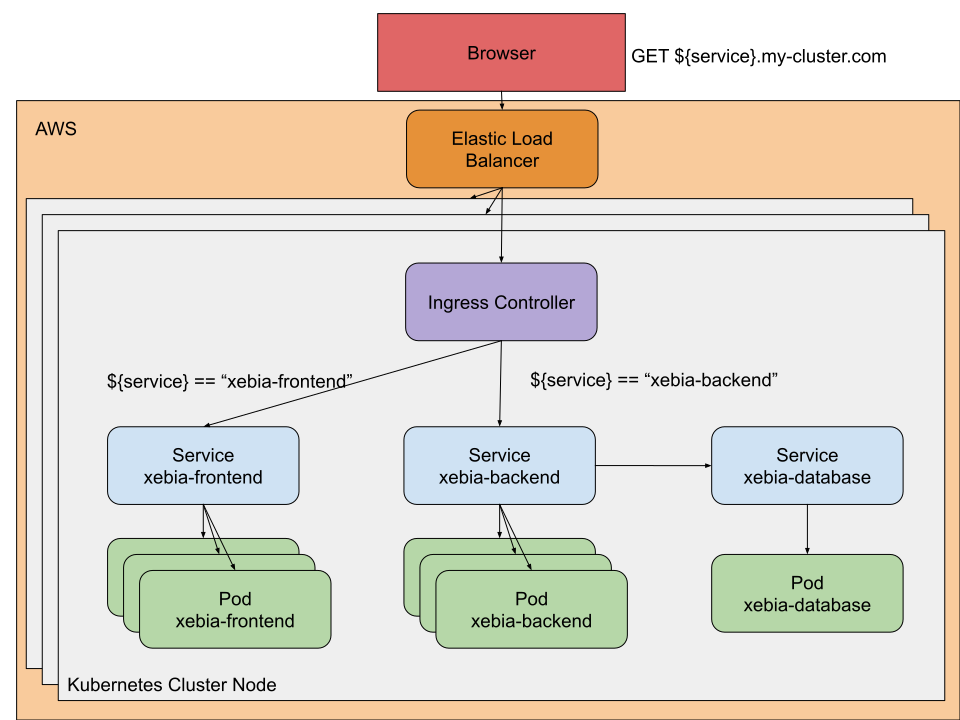

# Application configuration
In the [previous exercise](../exercise2/README.md) we learnt to parametrize our pipeline, 
and we added a new parameter "version".

The Deployment manifest of the Xebifront application should look like:
```yaml
apiVersion: apps/v1
kind: Deployment
metadata:
  labels:
    app: xebifront
  name: xebifront-deployment
spec:
  replicas: 1
  selector:
    matchLabels:
      app: xebifront
      environment: dev
  template:
    metadata:
      labels:
        app: xebifront
        environment: dev
    spec:
      containers:
        - image: 'jcalderan/xebifront:${parameters.version}'
          name: xebifront
          ports:
            - containerPort: 80
```

Using the pipeline of the project Xebicon, deploy the version "v2".  

This version of Xebifront use a Backend application in order to fetch the Xebicon Slots to display.  
In order to get it working, we'll need to deploy two new applications:
- xebiback: the API consumed by xebifront
- xebidaatbase: the database hosting the Xebicon slots data 

## Seting up the backend application
Create a new application [xebia-backend](../../utils/xebia-backend.md), and set up a new pipeline in order to:
- deploy a new Service named "xebia-backend"
- deploy a Kubernetes Deployment (use the docker image ```jcalderan/xebiback:v1```)

This application is a simple Node application which **listen on port 8080**, and expose **two endpoints**:
- /slots: fetch all slots stored in database
- /health: return ```200 OK {"status": "up"}``` when the application is up and running 


## Setting up the database
Create a new application [xebia-database](../../utils/xebia-database.md), and set up a new pipeline in order to:
- deploy a new Service named "xebia-database"
- deploy a Kubernetes Deployment (use the docker image ```jcalderan/xebidatabase:v1```)

This application is a single node mongodb database application which **listen on port 27017**.

## Wiring up everything
We need to connect all three components.  
Both the front end and the backend applications have to be exposed to the Internet through a domain name, 
while the database must be exposed only to the inside.  
The following diagram illustrate this setup.


In order to access both applications from the Internet, we'll use a domain name which resolve to our kubernetes cluster:
- Route53 is a DNS web service by AWS, which has already been provisioned in order to resolve the domain name ```*.my-cluster.com```
- Elastic Load Balancer, is a Load Balancer by AWS which has been provisioned in order to forward traffic to the Kubernetes cluster nodes.  
- Ingress Controller is a Kubernetes components which implements Ingress rules in order to root incoming traffic to relevant Services.

Thus, route53 will resolve any subdomain of ```*.my-cluster.com``` and forward the traffic to the ELB which in turn will forward the traffic to the kubernetes cluster node.
 
Services and Pods names can be resolved [using DNS names](https://kubernetes.io/docs/concepts/services-networking/dns-pod-service/)
inside a Kubernetes cluster, using a name of the form:
- my-service.my-namespace.svc.cluster-domain.example
- my-pod.my-namespace.svc.cluster-domain.example

This means the application **xebia-backend** can connect to the service **xebia-database** using the DNS name ```xebia-database.your-namespace.svc.cluster.local```.


### Exercise
- Bake a set of Ingress Rules ???
- Update xebia-frontend service (TODO: give more insights)
- Update xebia-backend service(TODO: give more insights)
- Update xebia-database configmap(TODO: give more insights)

