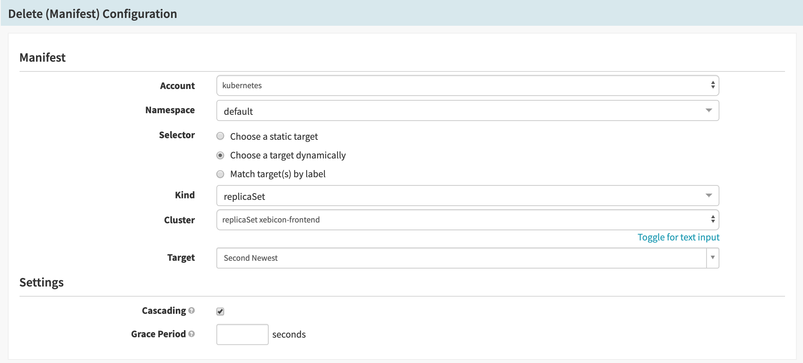
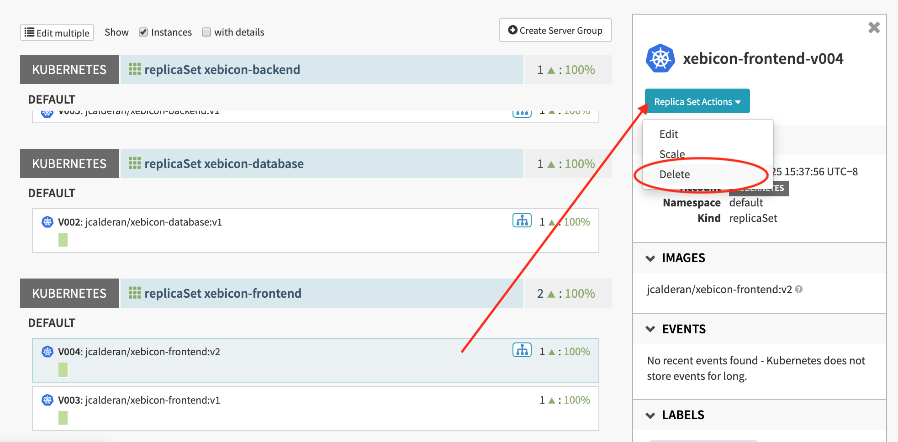
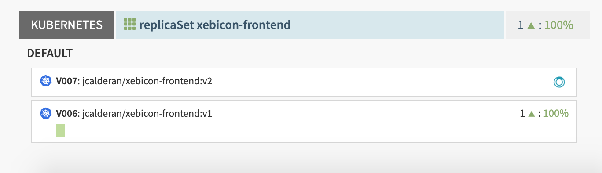
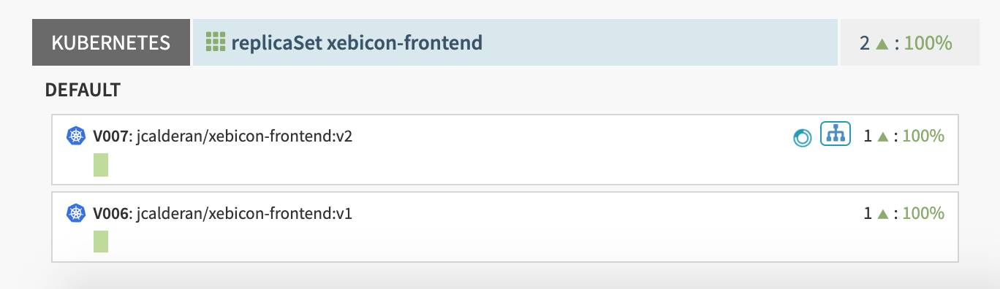
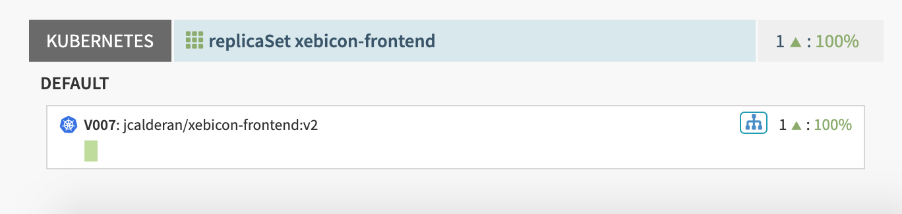
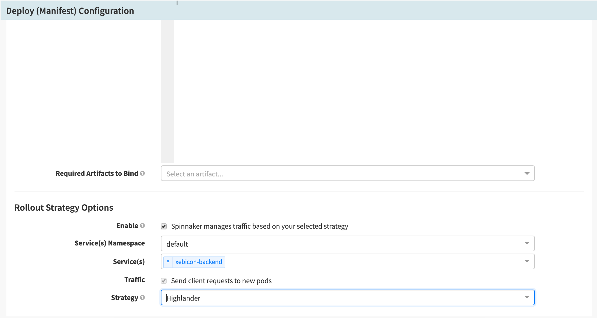
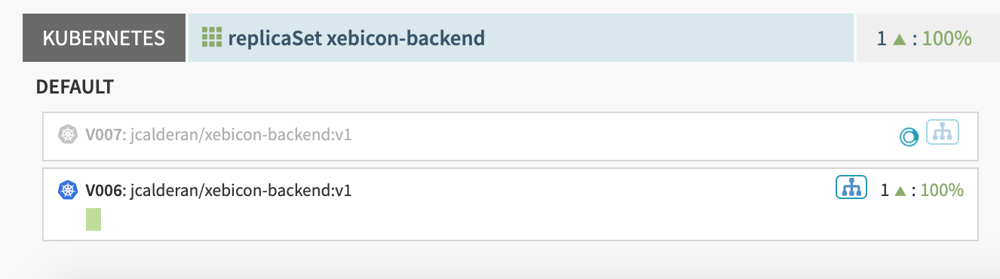

# Highlander deployment
In the [previous exercise](../exercise3/README.md) we set up the *xebicon-app* deployment pipelines.  
An issue remains: the successive execution of each Pipeline creates outdated but still active Server Groups.  
If you encountered issues with your deployments, you might already had to manually delete some of these.

Is there a way to delete automatically old Server Groups when deploying new ones ?

## Using stages  
The Kubernetes V2 Cloud Driver we use in this hands-on provides stages to interact with Kubernetes manifests:
- [Bake (Manifest)](https://www.spinnaker.io/guides/user/kubernetes-v2/deploy-helm/): turns a template into a manifest using a template Engine (HELM2 by default)
- [Patch (Manifest)](https://www.spinnaker.io/guides/user/kubernetes-v2/patch-manifest/): Patch a Kubernetes manifest 
- Scale (Manifest): scale the number of replicas managed by this manifest
- Delete (Manifest): delete the specified manifest
- Deploy (Manifest): deploy the specified manifest
- Enable (Manifest): enable the specified manifest by switching its traffic on
- Disable (Manifest): disable the specified manifest by switching its traffic off
- [Run Job (Manifest)](https://www.spinnaker.io/guides/user/kubernetes-v2/run-job-manifest/): run a [kubernetes job](https://kubernetes.io/docs/concepts/workloads/controllers/jobs-run-to-completion/)
- Undo Rollout (Manifest): Rollback a manifest

### Exercise:
We can use the **Delete (Manifest)** stage in order to implement a simple Highlander deployment.  
Modify the **frontend-dev** Pipeline:
- add a new **Delete (Manifest)** stage
- select the account **kubernetes**
- select the namespace **default**
- select "**Choose a target dynamically**"
- select the kind "**replicaSet**"
- select the cluster "**replicaSet xebicon-frontend**"
- select the target "**Second Newest**"
- name the stage "**Delete old replicaSet**"
- save your changes



Head to the **Infrastructure** page, and manually **delete all Server Groups running in the Cluster "replicaSet xebicon-frontend"**.  


Get back to the **Pipelines** page:
- run the Pipeline "**fronted-dev**" with the parameter **version=v1**
- wait for completion: the last stage fails after some times, because Spinnaker can't resolve the second oldest manifest
- run the Pipeline "**fronted-dev**" with the parameter **version=v2**


First, the new Server Group being deployed appears, but no instance has spawn yet.


Then an instance spawn, and the Load Balancer (Service) is attached to the Server Group.


Finally, as the new Server Group stabilizes, the old one is removed.

### Solution
<details>  
  <summary>Pipeline solution</summary>  
  <p>  
    Click "Pipeline Actions" (upper right), then click "Edit as JSON", and copy paste the following JSON.  

```json
```
  </p>
</details>  

## Built-in deployment strategies
Spinnaker provides a set of built-in deployment strategies, such as Highlander, Red/Black or Canary.
These strategies implementations are tightly coupled with the Cloud Provider in use (here: Kubernetes Cloud Provider v2), performing deployment in regard of Cloud Provider constraints and deployment best practices. 

### Exercise
We will modify the **backend-dev** to use the Highlander built-in strategy.  
Because of how Spinnaker implements its strategies internally, we'll need to make sure the selector's name used by the Service to attach to the ReplicaSet is 
different from the selector's name used by the replicaSet to find its Pods.  
Modify the Service manifest and the ReplicaSet manifest according to the followings YAML:  
- Service Manifest
```yaml
apiVersion: v1
kind: Service
metadata:
  name: xebicon-backend
spec:
  ports:
    - port: 80
      protocol: TCP
  selector:
    workload-app: xebicon-backend               # prefixed with 'workload'
    workload-environment: dev                   # prefixed with 'workload'
    workload-version: '${parameters.version}'   # prefixed with 'workload'
```
- ReplicaSet manifest
```yaml
apiVersion: apps/v1
kind: ReplicaSet
metadata:
  labels:
    workload-app: xebicon-backend               # match the service selector
    workload-environment: dev                   # match the service selector
    workload-version: '${parameters.version}'   # match the service selector
  name: xebicon-backend
spec:
  replicas: 1
  selector:
    matchLabels:
      app: xebicon-backend                      # different from the Service selector
      environment: dev                          # different from the Service selector
      version: '${parameters.version}'          # different from the Service selector
  template:
    metadata:
      labels:
        app: xebicon-backend                    # match the replicaSet selector
        environment: dev                        # match the replicaSet selector
        version: '${parameters.version}'        # match the replicaSet selector
    spec:
      containers:
        - env:
            - name: DB_URL
              value: 'mongodb://xebicon-database:27017'
          image: 'jcalderan/xebicon-backend:${parameters.version}'
          name: xebicon-backend
          ports:
            - containerPort: 80
```

- go to the "**Deploy ReplicaSet**" stage
- in the Manifest section, in the "Rollout Strategy Options" sub-section, **enable "Spinnaker manages traffic based on your selected strategy"**
- select the namespace **default**
- select the service "**xebicon-backend**"
- check "**Send client requests to new pods**"
- select the strategy "**Highlander**"
- save your changes



Head to the **Infrastructure** page, and manually **delete all Server Groups running in the Cluster "replicaSet xebicon-backend"**.  
Get back to the **Pipelines** page:
- run the Pipeline "**backend-dev**"
- wait for completion: the last stage fails after some times, because Spinnaker can't resolve the second oldest manifest
- run the Pipeline "**backend-dev**"


Spinnaker deploys a disabled Server Group, unable to accept traffic.  
The old Server Group is still accepting traffic, until the new Server Group spawn instances.  
When the new Server Group is ready, the old one is automatically deleted.

### Solution
<details>  
  <summary>Pipeline solution</summary>  
  <p>  
    Click "Pipeline Actions" (upper right), then click "Edit as JSON", and copy paste the following JSON.  

```json
```
  </p>
</details

## Summary
We can either implement our own deployment strategy, or rely on one of the built-in strategies Spinnaker provides.  
Combining stages allows to fine tune the deployment strategy in order to match complex use cases and requirements, 
while the buil-in strategies provided by Spinnaker ensure deployment best practices are in use.

[previous](../exercise3/README.md) | [home](../../README.md)
