# Blue/Green deployment
## Introduction

Blue/Green deployment, also called Red/Black in Spinnaker, is a deployment pattern based on switching traffic between two identical environments running different versions of an application.

This technique allows to avoid common pitfall associated with deploying a software, such as downtime and the lack of rollback capability.

Blue environment represents the current version of the application served in production. In parallel, the green environment is staged running a different version of the application. After the green environment is ready and tested, production traffic is redirected from blue to green environment.

If any problems are identified, you can rollback by reverting traffic back to the blue environment.

For example, We have an application called xebicon-app. This application is served by a service called xebicon-service. The version V1 is our blue version of the application

  

We need to update the version of our application to "v2", which become the green version. Then a battery of tests should be run against this version in order to check if everything is working as expected.

  

After checking the green version is up and running, and work as expected, we switch the traffic from the blue version to the green version.

  

Now the user use the application version "v2".

Let's say we notice a critical bug which passed through the validation process and has been deployed along the new version.
Since the previous version of the application is still up and running , yet not exposed to production traffic, we can easily switch back the traffic from the new version to the old one.

  

In the end of part 3, we will create a Blue/Green deployment strategy 

[previous](../part2/exercise3/README.md) | [next](./exercice1/README.md)

