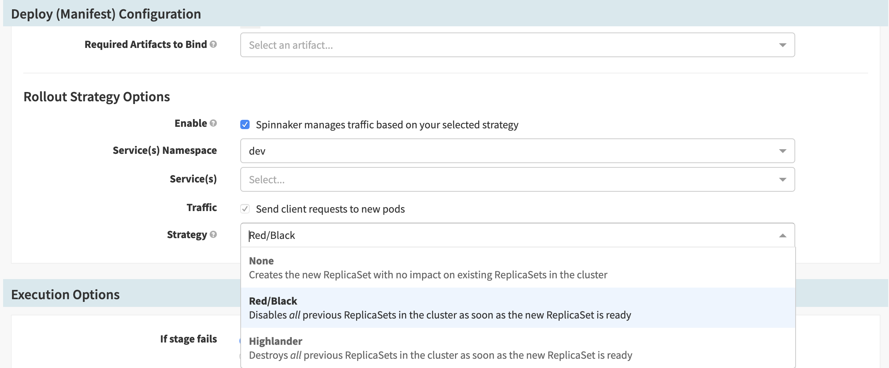

# Blue/Green deployment
## Exercice 1:

To use Spinnaker Red/Black deployment, we are going to use ReplicaSet instead of deployment.

You can start the application from this pipeline templates:

Create a new pipeline called Xebicon-service from this template.

You should replace the comment in the template by a value of your choice.

For each template, you should create a new pipeline. 

In the pipeline Actions, you can click on `edit as Json` and paste the template.


<details><summary>Service pipeline</summary>
<p>

```

{
  "isNew": true,
  "keepWaitingPipelines": false,
  "limitConcurrent": true,
  "stages": [
    {
      "account": "my-k8s-v2-account",
      "cloudProvider": "kubernetes",
      "isNew": true,
      "manifests": [
        {
          "apiVersion": "v1",
          "kind": "Service",
          "metadata": {
            "labels": null,
            "name": null
          },
          "spec": {
            "ports": [
              {
                "port": null,
                "protocol": "TCP",
                "targetPort": null
              }
            ],
            "selector": null,
            "type": "ClusterIP"
          }
        }
      ],
      "moniker": {
        "app": "test1"
      },
      "name": "Deploy (Manifest)",
      "refId": "1",
      "requisiteStageRefIds": [],
      "skipExpressionEvaluation": false,
      "source": "text",
      "trafficManagement": {
        "enabled": false,
        "options": {
          "enableTraffic": false,
          "namespace": null,
          "services": [],
          "strategy": null
        }
      },
      "type": "deployManifest"
    }
  ],
  "triggers": [],
}

```
</p>
</details>

You can run the service pipeline to create it.

Create a new pipeline called Xebicon-deployment from this template:

<details><summary>Deployment pipeline</summary>
<p>

```

{
    "stages": [
      {
        "account": "my-k8s-v2-account",
        "cloudProvider": "kubernetes",
        "manifests": [
          {
            "apiVersion": "v1",
            "kind": "Service",
            "metadata": {
              "name": "my-service",
              "namespace": "dev"
            },
            "spec": {
              "ports": [
                {
                  "port": 80,
                  "protocol": "TCP"
                }
              ],
              "selector": {
                "frontedBy": "my-service"
              }
            }
          }
        ],
        "moniker": {
          "app": "test1"
        },
        "name": "Deploy (Manifest)",
        "namespaceOverride": "",
        "refId": "1",
        "requisiteStageRefIds": [],
        "skipExpressionEvaluation": false,
        "source": "text",
        "trafficManagement": {
          "enabled": false,
          "options": {
            "enableTraffic": false,
            "services": []
          }
        },
        "type": "deployManifest"
      }
    ]
}

```

</p>
</details>


Let update our app the new version using B/G deployment.

You can change your application version to V2. We suppose that this version is production ready.
to do this, please follow the instruction bellow:
1. Check the Box "Spinnaker manages traffic based on your selected strategy" in the  Rollout Strategy Options section 

2. Select the service created by the previous pipeline
3. Select Red/Black as deployment strategy
4. Save the pipeline
5. Run the pipeline

You can navigate to the infrastructure and check the new replicaset created by this pipeline

You can notice the previous replicaset is disabled and the pods are still running

[previous](../README.md) | [next](../exercice2/README.md)


