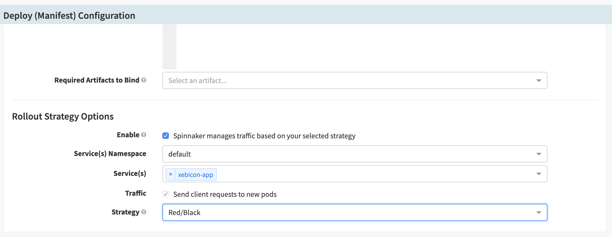

# Blue/Green deployment
## Exercice 1:

Spinnaker deployment Red/Black is implemented with Kubernetes ReplicaSet.

### Deploy Service

* Create a new pipeline called Xebicon-service.

* Add new stage to the pipeline.

* In the new stage, choose `Deploy manifest` and paste the yaml template bellow 

```

apiVersion: v1
kind: Service
metadata:
  name: xebicon-app
spec:
  ports:
    - port: 80
      protocol: TCP
      targetPort: 8080
  selector:
    app: xebincon-app
  type: ClusterIP

```

* Save the pipeline

* Run the pipeline


### Deploy ReplicaSet

* Create a new pipeline called Xebicon-rs.

* Add new stage to the pipeline.

* In the new stage, choose `deploy manifest` and use the yaml the template bellow 


```

apiVersion: apps/v1beta2
kind: ReplicaSet
metadata:
  labels:
    applicationName: xebicon-app
  name: xebincon-app
spec:
  replicas: 3
  selector:
    matchLabels:
      applicationName: xebicon-app
  template:
    metadata:
      labels:
        applicationName: xebicon-app
    spec:
      containers:
        - image: 'chakch007/node-web-app:${parameters["version"]}'
          name: primary
          ports:
            - containerPort: 8080

```

* In the Configuration stage, Add a new parameter named `version` 

* Save the pipeline

* Run the pipeline with application and set version to v1

* You can check that you application is deployed in the infrastructure section

### Deploy new application version using Red/Black

We are going to update our application version to v2

* Go back to the pipeline Xebicon-rs

* Select the deploy `manifest stage`

* Go to Deploy `manifest stage configuration section`

* check the box, to let spinnaker manages traffic

* Select the namespace where did you deployed the service

* Select the service created in the beginning of the exercice

* Select strategy: Red/Black



* Save the pipeline

* Run the pipeline with v2 version as parameter

* In the infrastructure, you should see a new replicaSet deployed and the previous one disabled

Great! now that we have implemented the Red/Black deployment, we need to implement the rollback pipeline

[previous](../README.md) | [next](../exercice2/README.md)


