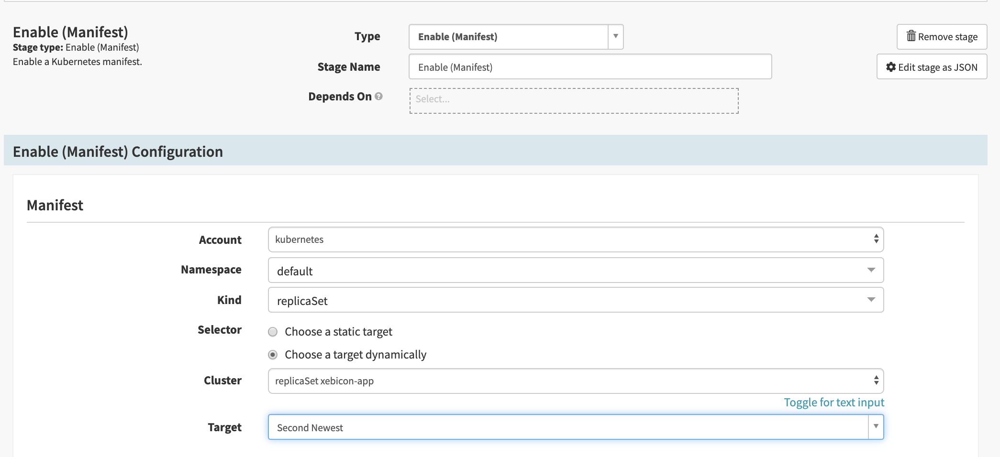
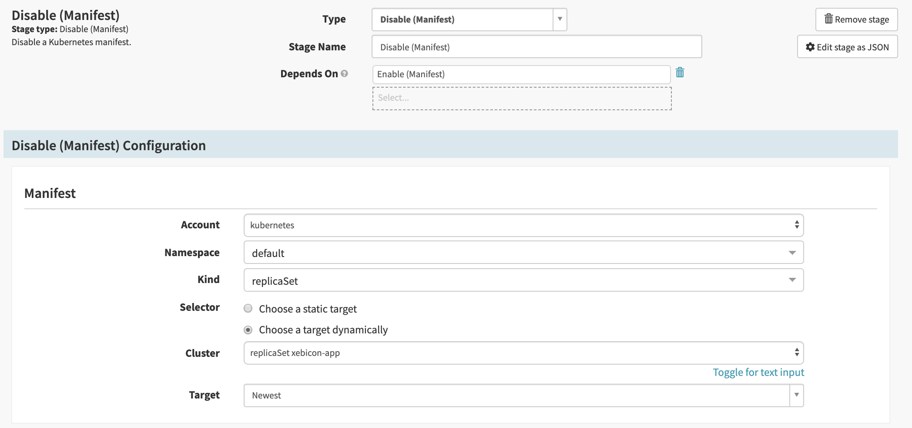
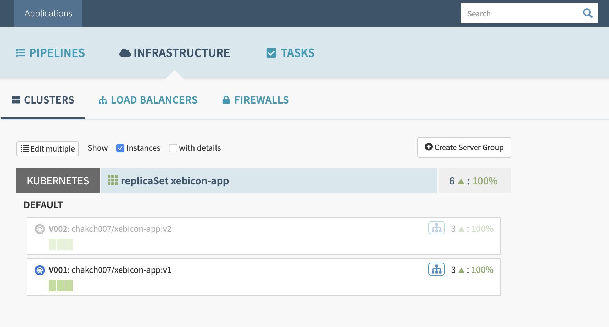

# Blue/Green deployment
## Exercice 2:

* Create a new pipeline named Rollback

* Add new Stage

* Choose stage type `enable manifest`.

* You can name the stage : `Enable previous version`

- In the `Enable (Manifest) Configuration`:

    - Select the namespace where did you deployed you application

    - Select ReplicaSet as Kind

    - Choose a `Choose a target dynamically`

    - Select your replicaSet in the Cluster section

    - Choose Second Newest as Target 

* Add new Stage

* Choose stage type `disable manifest`.

* You can name the stage : `disable newest version`

- In the `Disable (Manifest) Configuration`:

    - Select the namespace where did you deployed you application

    - Select ReplicaSet as Kind

    - Choose a `Choose a target dynamically`

    - Select your replicaSet in the Cluster section
    
    - Choose Newest as Target 

* Save the pipeline

* Run the pipeline

* In the infrastructure section, you can see that the v2 is disabled and v1 is enabled

[previous](../exercice1/README.md) | [next](../exercice3/README.md)

