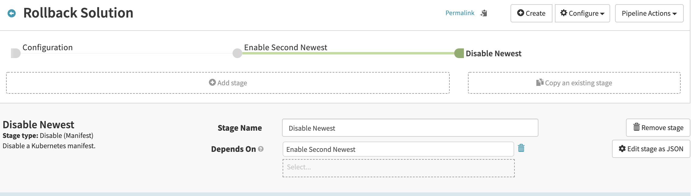

# Blue/Green deployment
## Exercice 2:

Now You become familiar with spinnker, you can create the rollback pipeline.
Let's create the pipeline bellow:

* Create new Stage: this stage is enable the previous application version
* This Stage should depend from the pipeline input
* Choose enable manifest and select the second newest version
* Create another stage: this stage will disable the newest version 
* This Stage should depend from the pipeline input
* Choose enable Manifest and select the second newest version

How can you improve this pipeline to prevent downtime?

Solution

[previous](../exercice1/README.md) | [next](../exercice3/README.md)

