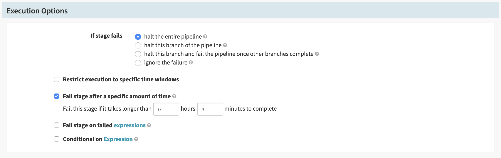
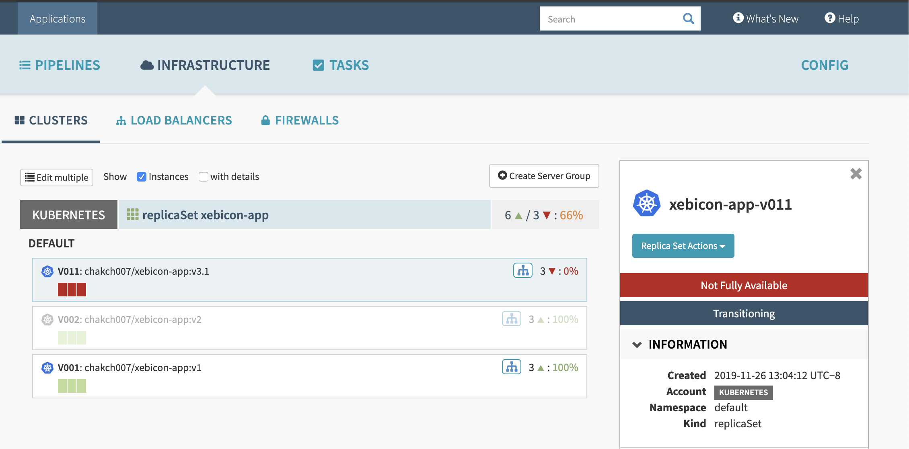
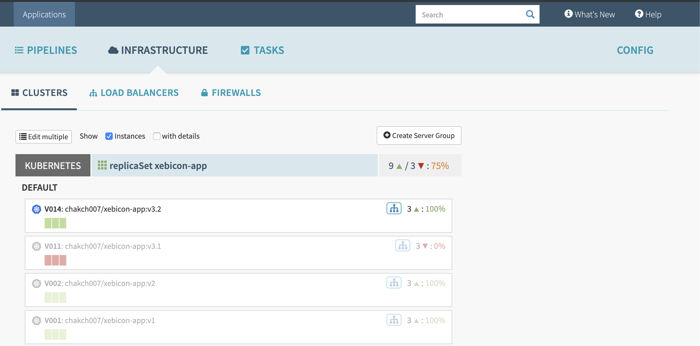
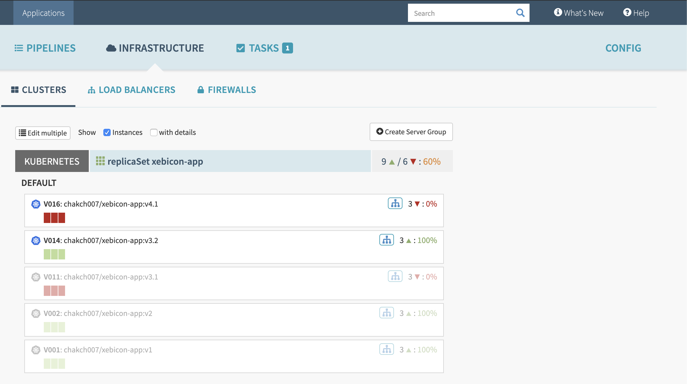
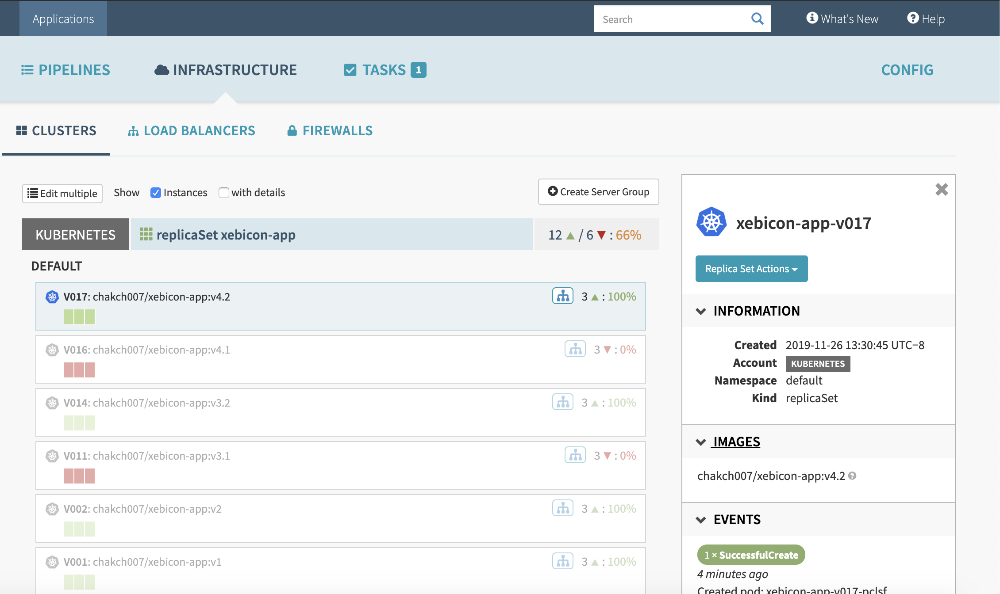

# Blue/Green deployment
## Exercice 3:

To improve our deployment process, we can use two kubernetes feature to check that our application is healthy and ready to serve traffic.

The Livenness and Readiness probe check that our application is healthy and ready to serve content.

The main difference between this feature is: 

* Liveness: indicates when a pod is "alive"

* readiness: indicate when a pod is ready to serve request 

Further information are available in the [kubernetes documentation](https://kubernetes.io/docs/tasks/configure-pod-container/configure-liveness-readiness-startup-probes/)

In this exercise we are going to use this two features to improve the Blue/Green deployment

For this exercise:

* The liveness probe is available via http GET on port **8080** and path **/heathz**. 

* The readinees probe is available via http on port **8080** and path **/**.

* the docker images are available on this repo: **chakch007/xebicon-app:tagname**.

* The default stage timeout is 30 minutes. You should modify the stage timeout to get feedback quickly



### Task 1: Add LivenessProbe

In this task, we are going to discover the impact of Liveness of on our deployment and pipeline:

* You can add Liveness probe to the deployment pipeline in the spec section. 

```

  livenessProbe:
    failureThreshold: 1
    httpGet:
      path: /healthz
      port: 8080
    initialDelaySeconds: 1
    periodSeconds: 1

```

* Deploy the version v3.1 of the application

* What do you observe in the infrastructure section ?


<details><summary>Solution</summary>
<p>




The previous pipeline fails because our container is not ready to start.

You can check a deployed pod and see that the check of the Liveness probe fails. 

</p>
</details>

* You can deploy application version v3.2 and you should see this result 





### Task 2: Add ReadinessProbe

The liveness probe is a flag to indicate that our container is running, but it can't verify that our application can serve traffic

The Readiness probe can be used to check that the application's critical component are ready to serve request.

* Add Readiness probe to the deployment pipeline in the spec section. 

```

  readinessProbe:
    failureThreshold: 1
    httpGet:
      path: /
      port: 8080
    initialDelaySeconds: 1
    periodSeconds: 1

```

* Deploy The application version v3.3

* What do you observe in the infrastructure section? 


<details><summary>Solution</summary>
<p>




The previous pipeline fails because / response 500

</p>
</details>


* You can deploy application version v3.4




[previous](../exercice2/README.md)
